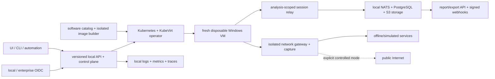

# MalZone

**Enterprise-controlled malware-analysis infrastructure.**

MalZone is a planned, entirely self-hosted interactive malware-analysis platform for organisations
that need samples, analysis, evidence, identity, and operations to remain under their control. The
product goal is an analyst experience inspired by [ANY.RUN](https://any.run/)—live desktop
interaction, process tree and timeline, network/DNS/HTTP activity, files and registry, detections,
artifacts, PCAP, and reports—implemented on infrastructure the operator controls.

MalZone is not affiliated with ANY.RUN and does not depend on its service. The required control,
identity, virtualization, telemetry, storage, detection, and reporting paths are designed to work
locally and air-gapped. Optional public-Internet access is a separately governed sandbox-egress
mode, never a requirement or default.

## Current status

The repository is in the architecture/design stage. No executable sandbox is claimed yet. The
[implementation-conformance map](docs/design/high-level/00-implementation-conformance.md) is the
authoritative record of what is implemented, configuration-ready, designed, or not started.

The original idea is preserved at [docs/prompts/v1.md](docs/prompts/v1.md). The canonical design
derived from it starts at [docs/design/high-level/design_01.md](docs/design/high-level/design_01.md).

## Business value and positioning

MalZone is commercially strongest as **enterprise-controlled malware-analysis infrastructure**, not
as a generic local copy of an existing cloud sandbox. Its initial market hypothesis is that
government, defence, national CERT, critical-infrastructure, financial-services, healthcare, DFIR,
security-vendor, and large MSSP teams will pay for capabilities that public-cloud analysis cannot
always provide:

- samples, telemetry, evidence, identity, monitoring, and reports remain under customer control;
- required workflows continue to operate locally and in air-gapped environments;
- exact, reviewed Windows software versions can be composed into reproducible immutable images;
- analysts receive live interaction and behavioural evidence without direct access to KubeVirt or
  the cluster;
- versioned APIs, machine identities, exports, and signed webhooks integrate with local SOC, SIEM,
  SOAR, TIP, case-management, and evidence workflows;
- evidence provenance, audit, isolation, retention, and deterministic cleanup are product
  properties rather than deployment assumptions.

The market is real but competitive. Open-source CAPE already provides substantial sandbox and
instrumentation capability; Joe Sandbox offers an on-premises product; Hatching Triage offers live
interaction, APIs, custom profiles, and private deployments; and cloud services such as ANY.RUN
offer convenience, broad adoption, and a mature analyst experience. MalZone therefore must not
compete merely on executing a file or displaying a process tree. Its differentiation must come
from deployability, data sovereignty, API-first operations, customer-specific image composition,
defensible evidence, and supported lifecycle management.

The first sellable scope should remain deliberately narrow: one supported Windows 11 baseline,
file submission, live desktop and core process/file/registry/network telemetry, PCAP, structured
reports, offline/simulated networking, OIDC/RBAC/audit, deterministic cleanup, and a small tested
software catalogue. Advanced debugging, broad guest-OS support, large-scale memory forensics, and
speculative AI features should follow only after the core isolation and evidence loop is reliable.

Commercial validation should precede a large implementation investment. The current gate is to
secure design-partner evidence from target organisations and, ideally, paid pilots showing that
customers specifically need local or air-gapped deployment, custom Windows profiles, API
integration, and supported updates. The full hypothesis, competitive assessment, packaging model,
risks, validation questions, and go/no-go measures are in the
[business value and market strategy](docs/design/business/business-value-and-market-strategy.md).

## Architecture in one view



The Windows guest receives no Kubernetes pod network, service-account token, host mount, shared
credential, or direct storage access. Each analysis receives a fresh snapshot clone, unique
networks and identity, bounded relay, and cleanup inventory. A terminal result is not published
until all session resources are gone.

## Design documentation

- [Business value and market strategy](docs/design/business/business-value-and-market-strategy.md)
- [High-level design index](docs/design/high-level/README.md)
- [Objectives and product capability map](docs/design/high-level/10-overall/01-objectives-principles.md)
- [Runtime lifecycle and `Analysis` CRD](docs/design/high-level/10-overall/02-runtime-topology-lifecycle.md)
- [APIs, events, and data ownership](docs/design/high-level/10-overall/03-contracts-data.md)
- [Components and technology decisions](docs/design/high-level/10-overall/04-components-technology.md)
- [Software catalog and custom Windows images](docs/design/high-level/10-overall/05-software-catalog-image-composition.md)
- [API, SSO, observability, and workflow integrations](docs/design/high-level/10-overall/06-api-identity-observability-integrations.md)
- [Kubernetes/KubeVirt deployment](docs/design/high-level/20-deployment/01-kubernetes-kubevirt.md)
- [Threat model and zero-trust controls](docs/design/high-level/30-security/01-threat-model-zero-trust.md)
- [Day-2 operations and SRE](docs/design/high-level/40-operations/01-day2-sre.md)
- [Delivery roadmap and acceptance gates](docs/design/high-level/50-roadmap/01-delivery-roadmap.md)
- [Architecture decisions](docs/design/decisions/README.md)
- [Repository design-sync governance](docs/prompts/governance/README.md)
- [Machine-readable contracts](contracts/README.md)

## Safety

MalZone is intended only for authorized defensive research, DFIR, and SOC work. Treat samples,
guest telemetry, screenshots, packet captures, dropped files, archives, reports, and filenames as
hostile. Do not connect an analysis network to corporate systems or enable controlled egress until
the real-cluster negative isolation suite passes.

## Design validation

The documentation checks use only the Python standard library:

```bash
make design-check
```

All human and AI-assisted contributions must follow [CLAUDE.md](CLAUDE.md), including change
classification, synchronized conformance/design/contracts, executable evidence, and the automatic
changed-file design-sync gate. `AGENTS.md` makes the same policy discoverable to coding agents.
