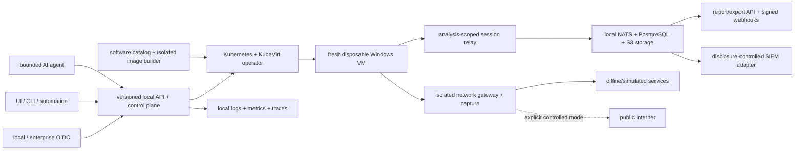

# MalZone

**Enterprise-controlled malware-analysis infrastructure.**

MalZone is a planned, entirely self-hosted interactive malware-analysis platform for organisations
that need samples, analysis, evidence, identity, and operations to remain under their control. The
product goal is an analyst experience inspired by [ANY.RUN](https://any.run/)—live desktop
interaction, process tree and timeline, network/DNS/HTTP activity, files and registry, detections,
artifacts, PCAP, and reports—implemented on infrastructure the operator controls.

MalZone is not affiliated with ANY.RUN and does not depend on its service. The required control,
identity, virtualization, telemetry, storage, detection, and reporting paths are designed to work
locally and air-gapped. Optional public-Internet access is a separately governed sandbox-egress
mode, never a requirement or default.

## Current status

The production malware sandbox remains in the architecture/design stage. The repository now also
contains a harmless, executable Kubernetes lifecycle POC: a Go API, `Analysis` CRD/operator, locked-
down Linux canary runner, observe-only agent action, metadata-only ECS adapter/development sink,
Helm chart, and k3d end-to-end test. It does not execute files, accept desktop input, run an AI
model, or provide a Windows/KubeVirt sandbox. The [implementation-conformance map](docs/design/high-level/00-implementation-conformance.md)
is the authoritative record of what is implemented, configuration-ready, designed, or not started.

The original idea is preserved at [docs/prompts/v1.md](docs/prompts/v1.md). The canonical design
derived from it starts at [docs/design/high-level/design_01.md](docs/design/high-level/design_01.md).

## Architecture in one view



The Windows guest receives no Kubernetes pod network, service-account token, host mount, shared
credential, or direct storage access. Each analysis receives a fresh snapshot clone, unique
networks and identity, bounded relay, and cleanup inventory. A terminal result is not published
until all session resources are gone.

## Design documentation

- [Business value and market strategy](docs/design/business/business-value-and-market-strategy.md)
- [High-level design index](docs/design/high-level/README.md)
- [Objectives and product capability map](docs/design/high-level/10-overall/01-objectives-principles.md)
- [Runtime lifecycle and `Analysis` CRD](docs/design/high-level/10-overall/02-runtime-topology-lifecycle.md)
- [APIs, events, and data ownership](docs/design/high-level/10-overall/03-contracts-data.md)
- [Components and technology decisions](docs/design/high-level/10-overall/04-components-technology.md)
- [Software catalog and custom Windows images](docs/design/high-level/10-overall/05-software-catalog-image-composition.md)
- [API, SSO, observability, and workflow integrations](docs/design/high-level/10-overall/06-api-identity-observability-integrations.md)
- [AI automation and SIEM export](docs/design/high-level/10-overall/07-ai-automation-siem.md)
- [Kubernetes/KubeVirt deployment](docs/design/high-level/20-deployment/01-kubernetes-kubevirt.md)
- [Threat model and zero-trust controls](docs/design/high-level/30-security/01-threat-model-zero-trust.md)
- [Day-2 operations and SRE](docs/design/high-level/40-operations/01-day2-sre.md)
- [Delivery roadmap and acceptance gates](docs/design/high-level/50-roadmap/01-delivery-roadmap.md)
- [Architecture decisions](docs/design/decisions/README.md)
- [Repository design-sync governance](docs/prompts/governance/README.md)
- [Machine-readable contracts](contracts/README.md)
- [Development POC runbook](docs/development/poc.md)
- [GitHub Pages documentation portal](docs/index.md)

## Safety

MalZone is intended only for authorized defensive research, DFIR, and SOC work. Treat samples,
guest telemetry, screenshots, packet captures, dropped files, archives, reports, and filenames as
hostile. Do not connect an analysis network to corporate systems or enable controlled egress until
the real-cluster negative isolation suite passes.

## Design validation

The documentation checks use only the Python standard library:

```bash
make design-check
```

All human and AI-assisted contributions must follow [CLAUDE.md](CLAUDE.md), including change
classification, synchronized conformance/design/contracts, executable evidence, and the automatic
changed-file design-sync gate. `AGENTS.md` makes the same policy discoverable to coding agents.
