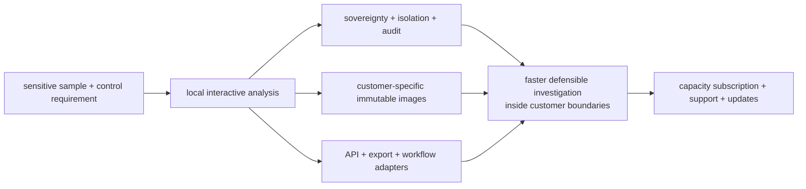

# MalZone Business Value and Market Strategy

## Executive decision

MalZone is a strong technical project and a credible commercial opportunity **only with focused
positioning**. The business should sell enterprise-controlled malware-analysis infrastructure for
regulated, sovereign, sensitive, and air-gapped environments. It should not enter the market as a
generic “ANY.RUN clone” or rely on Kubernetes/KubeVirt as the customer-facing differentiator.

The customer outcome is the ability to submit, interact with, observe, preserve, report on, and
destroy a hostile Windows analysis locally—with reproducible customer-specific software images,
strong evidence provenance, versioned automation interfaces, and operational support.

This document records a business hypothesis, not evidence of product implementation, product-
market fit, security assurance, customer demand, or revenue. Runtime maturity remains authoritative
in the [implementation-conformance map](../high-level/00-implementation-conformance.md).

## Strategic position

### Category

Self-hosted interactive malware-analysis and evidence platform.

### Positioning statement

For organisations that cannot send sensitive samples or evidence to a public service, MalZone is
an API-first interactive malware-analysis platform that runs inside infrastructure they control.
Unlike cloud-only sandboxes or manually assembled research environments, MalZone combines
disposable analysis sessions, custom immutable Windows software images, live analyst interaction,
defensible evidence, enterprise identity, workflow integration, and supported lifecycle operations.

### Value pillars

| Pillar | Customer problem | MalZone outcome |
|---|---|---|
| sovereignty | policy, confidentiality, residency, or classification prevents public submission | samples, telemetry, reports, identity, and evidence stay in customer-controlled systems |
| representative execution | malware behaviour depends on specific Office, browser, PDF, runtime, locale, or enterprise software versions | reviewed manifests resolve to exact, immutable, reproducible Windows images |
| interactive investigation | fully automated reports miss context or require a separate unsafe lab | live desktop and behavioural views share one authorized, auditable session |
| workflow automation | manual upload/download breaks SOC throughput and evidence handling | UI, CLI, machine clients, exports, and adapters use the same versioned APIs |
| defensible evidence | investigations need provenance, integrity, collection gaps, and custody records | signed manifests, hashes, profile/image/rule versions, audit, retention, and controlled export |
| operational assurance | bespoke labs are difficult to patch, scale, recover, and clean safely | supported deployment, capacity controls, monitoring, updates, rollback, and residue proof |

Self-hosting is valuable only when MalZone reduces the resulting operational burden. Public-cloud
products naturally remain better for customers whose dominant requirements are immediate setup,
elasticity, community intelligence, or avoiding infrastructure ownership.

## Initial customer segments

The segment order is a hypothesis to validate through interviews and paid pilots.

| Priority | Segment | Likely trigger | Buying concern |
|---:|---|---|---|
| 1 | government, defence, national CERT, sovereign SOC | classified or sensitive samples cannot leave an approved boundary | accreditation, air-gap updates, evidence custody, supply chain |
| 2 | critical infrastructure and regulated financial services | strict network separation, audit, data residency, incident response | operational resilience, integration, support ownership |
| 3 | DFIR laboratories and security vendors | repeatable customer-specific analysis and defensible reporting | image flexibility, throughput, evidence export, tenant separation |
| 4 | large MSSPs/MDR providers | customer-isolated analysis embedded into high-volume workflows | multi-project policy, automation, capacity economics, reporting |
| 5 | healthcare and pharmaceutical organisations | sensitive documents, patient/research data, regulated incident handling | privacy, retention, software licensing, constrained operations |

Small teams primarily seeking inexpensive occasional analysis are not the first commercial target.
They can often obtain more value from an established cloud service or a self-managed open-source
sandbox than from operating dedicated MalZone infrastructure.

## Competitive reality

This is an established category with credible alternatives:

| Alternative | Demonstrated strength | Implication for MalZone |
|---|---|---|
| ANY.RUN | mature cloud interactive experience and convenient analyst workflow | do not compete on a superficial UI clone; win where local control and deployment constraints dominate |
| CAPE | substantial open-source behavioural analysis, capture, interactive, YARA/Suricata, extraction, and debugging capability | platform buyers will compare MalZone against free software plus internal engineering; supported operations must justify price |
| Joe Sandbox Ultimate | commercial on-premises malware analysis | “on-premises” alone is not differentiation |
| Hatching Triage | live interaction, REST API, custom profiles, scaling, and private deployment options | API, private deployment, and custom profiles are category expectations, not a complete moat |
| internal research lab | maximum local flexibility and institutional knowledge | MalZone must reduce maintenance, reproducibility, integration, and assurance costs without removing expert control |

The platform must not claim an uncontested category. Competitive evaluation should include product
demos, deployment architecture, licensing, supported guest images, API coverage, telemetry depth,
evasion resistance, evidence integrity, upgrade model, and full three-year operating cost.

### Necessary differentiation

MalZone should compete on the combined system, not one feature:

1. complete local and air-gapped operation, including identity, observability, storage, reports,
   updates, and detection content;
2. deterministic customer-defined image composition from exact reviewed software pins;
3. API parity across UI, automation, exports, administration, and integrations;
4. evidence provenance, collection-health disclosure, audit, and reproducible reports;
5. disposable per-analysis identity, networking, storage, credentials, and residue verification;
6. maintainable enterprise deployment, compatibility, upgrade, rollback, recovery, and support.

Kubernetes/KubeVirt is an enabling implementation choice. It may support portability, automation,
and isolation, but customers purchase dependable analysis and control rather than an orchestrator.

## Durable assets and moat

Software manifests are important, but their schema alone is reproducible. Defensibility must accrue
through maintained operational and analysis knowledge:

- reliable Windows collection, tamper/degradation reporting, and anti-evasion research;
- curated, licensed, scanned, compatible software versions and validated image recipes;
- signed detection content, behaviour rules, family/configuration extractors, and test corpora;
- compatibility evidence across Windows, KubeVirt, storage, CNI, agent, and application versions;
- safe evidence processing, provenance, deterministic reporting, and case-workflow integrations;
- automated deployment, isolation verification, upgrades, rollback, recovery, and support data;
- customer trust earned through independent assessment, transparent gaps, and dependable response.

The moat grows only if these assets remain current. A visually polished interface over shallow or
stale telemetry is not defensible.

## First sellable product

The first commercial release should be narrow, complete, and supportable:

- one approved Windows 11 baseline and a small curated software catalogue;
- sample upload and analysis control through both API and UI;
- live desktop, process tree/timeline, file, registry, DNS, and network telemetry;
- screenshots, PCAP, event history, artifact metadata, and controlled downloads;
- deterministic structured JSON and isolated human-readable reports;
- offline and simulated network modes; controlled egress is not required for the first sale;
- local/enterprise OIDC, project RBAC, scoped machine clients, and immutable audit;
- exact image recipe resolution, isolated build, provenance, approval, and promotion;
- deterministic cancellation, timeout, evidence finalization, cleanup, and residue proof;
- structured logs, metrics, traces, health, backup/restore, update, and rollback procedures.

Defer broad operating-system support, kernel debugging, advanced memory forensics, public anonymous
submissions, large integration catalogues, and model-generated conclusions until the core analysis,
isolation, evidence, and operations loop has executable proof.

## Packaging and revenue design

The primary model should be an annual subscription aligned with usable analysis capacity rather
than analyst seats alone.

| Offer | Included value | Commercial unit |
|---|---|---|
| platform | supported local control/data plane, one Windows baseline, API/UI, core telemetry and reports | concurrent analysis slots or validated node pack |
| enterprise operations | SSO/RBAC, immutable audit, HA/DR guidance, policy controls, monitoring and priority support | annual environment subscription |
| software/image service | curated package catalogue, recipe validation, compatibility and image-builder support | supported image/profile packs plus custom work |
| detection updates | tested YARA/Suricata/behaviour content, extractors and compatibility updates | annual content subscription |
| MSSP edition | project isolation, capacity controls, customer-scoped automation and reporting | capacity tier with project allowance |
| assurance services | deployment validation, isolation testing, upgrade drills and independent-assessment support | fixed-scope professional service |

Licensing must state clearly what is included offline, how updates cross an air gap, which Windows
and third-party software licences the customer supplies, and what compatibility/support boundary
applies. Avoid pricing that rewards unsafe overcommitment or obscures infrastructure cost.

## Route to market

1. Recruit five to ten design partners in the first two target segments.
2. Run structured discovery against their current sandbox, manual lab, sample sensitivity,
   required software images, integration path, concurrency, assurance process, and operating model.
3. Offer a bounded paid pilot with one Windows baseline and explicit success criteria.
4. Turn repeated deployment, image, workflow, and evidence requirements into the supported product;
   keep one-off consulting outside the core until repetition is proven.
5. Produce reference architecture, API examples, assurance evidence, and a transparent compatibility
   matrix before scaling sales.
6. Expand through DFIR/MSSP partners only after tenant/project isolation and support economics are
   measured.

Open-source components or a limited community edition may reduce adoption friction, but that
decision requires a separate strategy covering licence compatibility, support boundaries,
contribution security, detection-content ownership, and which operational capabilities fund the
business.

## Commercial validation gates

Large implementation investment should follow evidence, not enthusiasm.

### Discovery questions

- What does the organisation use today, and what concrete incident or policy makes it inadequate?
- Which samples or evidence cannot be submitted to a public or vendor-operated service, and why?
- Is fully air-gapped operation mandatory, or would a vendor-managed private deployment suffice?
- Which exact Windows and application versions affect analysis quality?
- Which API, SIEM, SOAR, TIP, case, identity, audit, and evidence systems must integrate?
- Who owns deployment, Windows licensing, image curation, malware research, upgrades, and incidents?
- What concurrency, time-to-result, retention, availability, and recovery outcomes are required?
- What budget already funds the current product, staff, lab, hardware, and support burden?
- Who signs the purchase, security acceptance, and operational handover?

### Go/no-go evidence

Proceed from design to a sellable implementation only when the following are supported by customer
evidence:

| Gate | Minimum evidence sought |
|---|---|
| differentiated need | repeated requirement for local/air-gapped control or customer-specific images that current alternatives do not satisfy adequately |
| willingness to operate | named customer owner for cluster/appliance, identity, network, storage, licensing, updates, and incident procedures |
| willingness to pay | at least two or three paid pilots or equivalent funded commitments, not only letters of interest |
| workflow value | a defined API-driven investigation flow with baseline time/cost and an agreed target improvement |
| security acceptance | agreement on threat model, forbidden paths, assessment evidence, residual risks, and controlled-egress policy |
| viable support boundary | a repeatable hardware/software/Windows compatibility envelope rather than arbitrary customer combinations |

A failed gate is useful evidence. It should narrow the segment, alter packaging, motivate a partner
strategy, or stop investment before the project accumulates an unsupportable platform.

## Business metrics

Early metrics must distinguish product-market evidence from engineering activity.

| Dimension | Leading measure |
|---|---|
| demand | qualified target organisations with a documented unsolved local-control requirement |
| conversion | discovery-to-paid-pilot and paid-pilot-to-annual-subscription conversion |
| value | analyst handling time, workflow steps, and time to a usable report versus the customer baseline |
| adoption | weekly active analysts, API-submitted share, analyses per supported slot, report/export consumption |
| reliability | successful analysis-and-cleanup rate, time to ready, telemetry completeness, support incidents per analysis |
| economics | annual recurring revenue per supported environment, deployment effort, support hours, hardware footprint, gross-margin contribution |
| retention | renewal, supported-profile expansion, additional capacity, and production workflow dependence |
| assurance | isolation-test pass rate, open high-risk findings, patch/update latency, and restore/upgrade drill success |

Analysis volume alone is not success if runs are incomplete, unsafe, unused, or expensive to
support. Revenue alone is not validation if it depends on unrepeatable custom engineering.

## Principal business risks

| Risk | Why it matters | Required response |
|---|---|---|
| established competitors | local, private, API, custom-profile, and open-source options already exist | compete on a validated combination of control, images, evidence, integration, and operations |
| continuous malware R&D | collectors and detections degrade as adversaries and Windows change | fund dedicated telemetry/evasion engineering and regression corpora as a core cost |
| containment failure | could affect customer infrastructure, reputation, liability, and accreditation | deny-by-default design, real negative tests, independent assessment, incident response, explicit residual risk |
| licensing | Windows and packaged commercial applications may restrict redistribution or automated images | customer-supplied entitlement, licence metadata, legal review, and supported catalogue policy |
| compatibility explosion | arbitrary OS/application combinations undermine reliability and margin | finite tested matrix, immutable recipes, admission policy, paid certification path |
| operational burden | customers may not have KubeVirt, networking, storage, and Windows expertise | validated appliance/reference profiles, automation, health checks, training, and support boundaries |
| long procurement and assurance | regulated buyers require evidence and multiple approvals | design partners, bounded pilots, reusable assurance pack, transparent conformance |
| controlled-egress abuse | malware traffic can harm third parties or expose the customer | offline/simulated default, appliance boundary, policy/kill switch, monitoring, legal review |
| feature-parity trap | chasing every competitor feature delays a trustworthy product | preserve the first-sellable scope and gate expansion on recurring paid demand |

## Strategic decision rules

- Prefer a smaller validated regulated segment over a broad undifferentiated sandbox market.
- Treat security, evidence integrity, image compatibility, and day-2 operations as product work.
- Do not describe designed controls as shipped or independently assured.
- Do not accept arbitrary customisation that breaks the supported compatibility envelope.
- Do not weaken isolation or cleanup to improve demo speed or superficial feature parity.
- Build only integrations backed by a real customer workflow and versioned public contract.
- Revisit positioning, packaging, gates, and risks after every pilot and at least quarterly.

## Market evidence and sources

The following primary vendor/project sources establish category capability and demand signals; they
do not independently verify vendor marketing claims or MalZone product-market fit:

- [CAPEv2 repository](https://github.com/kevoreilly/CAPEv2) documents a deep open-source malware
  sandbox feature set, while its [guest requirements](https://github.com/kevoreilly/CAPEv2/blob/master/docs/book/src/installation/guest_physical/requirements.rst)
  describe installing analysis applications such as browsers, PDF readers, and Office suites.
- [Joe Sandbox Ultimate](https://www.joesecurity.org/resources/Joe%20Sandbox%20Ultimate%20Feature%20Sheet.pdf)
  is offered as on-premises software.
- [Hatching Triage](https://hatching.io/triage/) advertises live interaction, REST APIs, custom VM
  profiles, scale, and private-cloud deployment; Hatching also documents
  [private-instance API use](https://hatching.io/blog/tt-2020-10-01/).
- ANY.RUN describes the privacy/customisation and maintenance trade-offs of
  [on-premises versus cloud sandboxes](https://any.run/cybersecurity-blog/what-is-malware-sandbox/).
- ANY.RUN's [Q1 2026 report](https://files.any.run/images/q1_26_cyber_risk_report_from_anyrun.pdf)
  reports more than two million investigations in the quarter. This is a vendor-reported demand
  signal, not an independently audited market-size estimate.

Market evidence was last reviewed on 2026-08-27 and must be refreshed before it is used in an
investment memorandum, pricing decision, sales claim, or market-size calculation.
