# ADR 0010: Bound AI Interaction and Isolate SIEM Export

- Status: accepted
- Date: 2026-08-27

## Context

MalZone should allow automation and AI agents to submit an admitted file, observe a disposable
Windows analysis, interact with its desktop, and route useful results to a local SIEM. Guest-visible
content is adversarial and can contain prompt injection. A model is probabilistic, may be
unavailable, and cannot be entrusted with cluster credentials, an unrestricted shell, direct VNC,
or authority over containment and cleanup. SIEM credentials and data-disclosure rules also differ
by installation and must not leak into core services.

## Decision

AI agents use the versioned public API as project-scoped machine clients. They submit through the
normal quarantine/hash/admission path and propose closed-schema actions. A deterministic policy
service checks action type, immutable profile, analysis phase, observation cursor, controller
lease, rate/budget, expiry, and approval before a session-scoped relay emits bounded console input.
Shells, arbitrary commands, arbitrary URLs, direct file transfer, and model-defined tools are not
accepted. Model output is untrusted data; deterministic evidence and reports remain authoritative.

MalZone retains one canonical versioned event model. Separate credential-owning adapters apply a
project disclosure policy and map approved metadata to ECS, OCSF, STIX 2.1, or another destination.
Delivery is at least once with deterministic event IDs, durable checkpoints, bounded retries, and
dead-letter handling. SIEM failure cannot block analysis stop or cleanup. Default export excludes
sample/artifact bytes, screenshots, memory, secrets, clipboard values, and raw sensitive payloads.

```mermaid
flowchart LR
    Model["model or playbook"] --> Proposal["closed action proposal"]
    Proposal --> Policy["deterministic admission"]
    Policy --> Relay["bounded session relay"]
    Relay --> Guest["disposable guest"]
    Guest --> Evidence["validated evidence"]
    Evidence --> Canonical["canonical event"]
    Canonical --> Disclosure["disclosure policy"]
    Disclosure --> Adapter["credential-owning adapter"]
    Adapter --> SIEM["SIEM / TIP / workflow"]
```

## Consequences

- Local and air-gapped model endpoints are supported without making inference a required runtime
  dependency.
- Every interaction is attributable, bounded, replayable at the normalized-event level, and
  revocable on cancellation or lease loss.
- More schemas, policy state, audit data, cursor handling, adapter lifecycle, and negative tests are
  required than with a direct remote-desktop bot or generic webhook.
- Integration mapping can evolve independently without introducing vendor SDKs or credentials into
  the API, operator, relay, guest, database, or event store.
- Model planning and SIEM delivery can degrade independently while deterministic analysis lifecycle
  and cleanup continue.

## Rejected alternatives

- Giving an AI agent RDP/VNC, shell, Kubernetes, or host access: too broad to authorize or audit and
  allows prompt injection to cross the containment boundary.
- Letting the model call arbitrary generated tools: tool definitions become an unreviewed execution
  contract and bypass immutable profile policy.
- Treating model summaries as verdict/evidence: not deterministic, reproducible, or defensible.
- Embedding a SIEM SDK and credential in core services: expands compromise impact and couples core
  release cadence to a vendor.
- Sending samples or complete evidence to SIEM by default: violates minimization and makes the
  destination an implicit malware repository.
