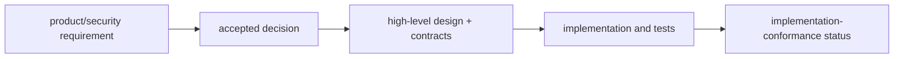

# MalZone Architecture Decision Records

Architecture decisions are durable constraints, not implementation claims. A decision changes only
through a superseding record; the conformance map records whether it is implemented.

| ADR | Decision | Status |
|---|---|---|
| [0001](0001-disposable-kubevirt-clones.md) | one disposable KubeVirt clone per analysis | accepted |
| [0002](0002-guest-network-isolation.md) | no guest pod network; separate management and detonation networks | accepted |
| [0003](0003-session-relay.md) | use an analysis-scoped non-routing relay | accepted |
| [0004](0004-state-authority.md) | PostgreSQL product authority and CR runtime authority joined by outbox/projection | accepted |
| [0005](0005-local-airgapped-baseline.md) | every required capability operates locally and air-gapped | accepted |
| [0006](0006-no-unrestricted-egress.md) | support offline, simulated, and controlled networking only | accepted |
| [0007](0007-gateway-appliance-boundary.md) | keep the production gateway off the cluster pod network | accepted |
| [0008](0008-immutable-software-recipes.md) | compose client software through immutable offline image recipes | accepted |
| [0009](0009-api-first-integrations.md) | expose UI and integrations through the same versioned API contracts | accepted |
| [0010](0010-bounded-ai-interaction-and-siem-export.md) | bound AI actions through deterministic policy and isolate SIEM export | accepted |
