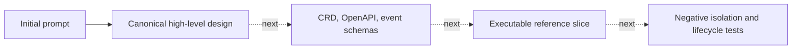

# MalZone Implementation Conformance

This is the truth map between the target architecture and this repository. Status labels are:

- **implemented:** working code/configuration and an automated verification path exist;
- **configuration-ready:** a working boundary exists but requires environment-owned infrastructure
  or credentials and has a documented conformance test;
- **designed:** the behavior and acceptance evidence are specified, but executable code is absent;
- **not started:** only a product idea or placeholder exists.

Documentation is never sufficient to mark a capability implemented.

## Repository state on 2026-08-27

| Capability | Status | Current evidence | Promotion evidence required |
|---|---|---|---|
| Product and architecture definition | implemented | `docs/design/high-level/` | Keep all design links and checks passing |
| Analysis REST/WebSocket API | designed | API contract in design | OpenAPI, implementation, unit/contract tests |
| Upload and hash verification | designed | data flow and security requirements | streamed upload tests, hash mismatch and quota negatives |
| `Analysis` CRD and operator | designed | lifecycle and CRD shape | generated CRD, envtest, idempotency/finalizer tests |
| Windows golden image pipeline | designed | deployment and security requirements | signed manifest, promotion records, clean-room rebuild test |
| Disposable KubeVirt clone | designed | clone/snapshot lifecycle | real CSI clone/boot/delete test and residue scan |
| Analysis-network isolation | designed | two-network topology | CNI-specific manifests plus prohibited-path packet tests |
| Session relay and identity | designed | protocol boundary | implementation, fuzzing, mTLS negatives, rate/size tests |
| Windows collection agent | designed | collector contract | signed binary, collector tests, tamper/degradation behavior |
| Network gateway/simulation/PCAP | designed | three network modes | offline/simulated/controlled egress tests and PCAP evidence |
| Metadata database and outbox | designed | ownership model | migrations, crash/replay tests, backup/restore test |
| Event stream and projections | designed | event envelope and ordering | schemas, compatibility tests, replay/deduplication test |
| Artifact storage and quarantine | designed | bucket/prefix policy | object policy tests, malicious preview/download tests |
| Web interface and console proxy | designed | UX/API boundary | browser tests, authorization and hostile-content tests |
| OIDC/RBAC/audit | designed | security model | IdP integration and role/cross-project negative tests |
| Metrics/logs/traces/SLOs | designed | operations baseline | dashboards, alerts, load and fault-injection evidence |
| HA, DR, and production upgrade | not started | roadmap requirements only | restore drill, rollback test, failure-domain test |

## Target runtime edges

There are no executable runtime services in the repository yet. When implementation begins, every
new runtime edge must be added here with source, destination, protocol, authentication, purpose,
data classification, timeout, and denial test. Undocumented edges fail design conformance.

| Source | Destination | Target protocol | Authentication | Intended data |
|---|---|---|---|---|
| browser/client | edge/API | HTTPS + WebSocket | OIDC access token | commands, metadata, live event envelopes |
| API | PostgreSQL | PostgreSQL/TLS | workload DB identity | product metadata and transactional outbox |
| dispatcher/operator | Kubernetes API | HTTPS | dedicated workload identity + RBAC | MalZone/KubeVirt resources only |
| relay | NATS | TLS | analysis-relay workload identity | bounded telemetry batches |
| relay | object broker/storage | HTTPS | analysis-scoped grant | one sample read; analysis-prefix writes |
| Windows agent | session relay secondary NIC | HTTPS/mTLS | one-use analysis certificate | heartbeat, sample request, events, artifacts |
| Windows VM | network gateway | IP | network placement; no trust | all detonation traffic |
| network gateway | approved public targets | proxied TCP/UDP | policy/session identity as applicable | controlled malware traffic |
| projector | PostgreSQL/object storage | TLS | dedicated workload identities | query projections and event chunks |

## Mandatory synchronization

Update this file in the same change whenever a service, route, event type, state owner, runtime
edge, trust boundary, readiness status, or verification path changes. An implementation is not
complete if this map claims more or less than the repository proves.

