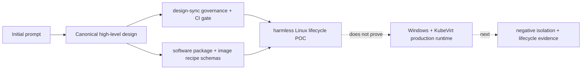

# MalZone Implementation Conformance

This is the truth map between the target architecture and this repository. Status labels are:

- **implemented:** working code/configuration and an automated verification path exist;
- **configuration-ready:** a working boundary exists but requires environment-owned infrastructure
  or credentials and has a documented conformance test;
- **designed:** the behavior and acceptance evidence are specified, but executable code is absent;
- **not started:** only a product idea or placeholder exists.

Documentation is never sufficient to mark a capability implemented.

## Repository state on 2026-08-27

| Capability | Status | Current evidence | Promotion evidence required |
|---|---|---|---|
| Product and architecture definition | implemented | `docs/design/high-level/` | Keep all design links and checks passing |
| Repository design-sync governance | implemented | `CLAUDE.md`, `AGENTS.md`, governance pack, reviewer-oriented PR template, automatic changed-file gate and automated tests | Keep CI required and extend synchronized path coverage with each implementation language/toolchain |
| Software package/image recipe contracts | implemented | two JSON schemas, fictional examples and contract tests | Add compatibility tooling and generated types when service implementation starts |
| Harmless lifecycle POC API | implemented | Go HTTP service, versioned POC OpenAPI, unit tests and k3d E2E script | Add authentication, durable product state, idempotency and production `/api/v1` contract before accepting samples |
| POC `Analysis` CRD and Job operator | implemented | namespace-scoped CRD, Go reconciler, context-aware cancellation, lifecycle/cleanup unit tests and k3d E2E evidence | Replace Job backend with the designed KubeVirt/relay/gateway lifecycle and finalizer/reaper fault tests |
| POC Helm packaging and runner isolation | implemented | Helm lint/render, least-privilege RBAC, restricted pod security, tokenless runner and deny-all runner NetworkPolicy | Validate production CNI/CSI/KubeVirt policies and forbidden paths on supported x86_64 virtualization nodes |
| Software catalog and image-build runtime | designed | catalog/build/promotion design and ADR | API, local mirror, resolver, isolated builder, promotion and negative tests |
| Production Analysis REST/WebSocket API | designed | `/api/v1` contract in design; POC API is explicitly non-production | OpenAPI, OIDC/RBAC, persistence, implementation and unit/contract tests |
| Upload and hash verification | designed | data flow and security requirements | streamed upload tests, hash mismatch and quota negatives |
| Production `Analysis` CRD and KubeVirt operator | designed | lifecycle and CRD shape; POC CRD has only canary/timeout/cancel fields | production CRD, generated types, admission, envtest, idempotency/finalizer and real-cluster tests |
| Windows golden image pipeline | designed | deployment and security requirements | signed manifest, promotion records, clean-room rebuild test |
| Disposable KubeVirt clone | designed | clone/snapshot lifecycle | real CSI clone/boot/delete test and residue scan |
| Analysis-network isolation | designed | two-network topology | CNI-specific manifests plus prohibited-path packet tests |
| Session relay and identity | designed | protocol boundary | implementation, fuzzing, mTLS negatives, rate/size tests |
| Windows collection agent | designed | collector contract | signed binary, collector tests, tamper/degradation behavior |
| Network gateway/simulation/PCAP | designed | three network modes | offline/simulated/controlled egress tests and PCAP evidence |
| Metadata database and outbox | designed | ownership model | migrations, crash/replay tests, backup/restore test |
| Event stream and projections | designed | event envelope and ordering | schemas, compatibility tests, replay/deduplication test |
| Artifact storage and quarantine | designed | bucket/prefix policy | object policy tests, malicious preview/download tests |
| Web interface and console proxy | designed | UX/API boundary | browser tests, authorization and hostile-content tests |
| OIDC/RBAC/audit | designed | security model | IdP integration and role/cross-project negative tests |
| Report/export API and workflow integrations | designed | API/identity/integration design | OpenAPI, export jobs, webhook dispatcher, signed delivery and adapter tests |
| Metrics/logs/traces/SLOs | designed | operations baseline | dashboards, alerts, load and fault-injection evidence |
| HA, DR, and production upgrade | not started | roadmap requirements only | restore drill, rollback test, failure-domain test |

## Implemented POC runtime edges

There are no executable **production** runtime services in the repository yet. The following edges
exist only in the harmless namespace-scoped POC; it accepts no samples, commands, URLs, or image
references and must not be used for malware. Undocumented implemented edges fail design conformance.

| Source | Destination | Protocol/authentication | Data | Bound and denial evidence |
|---|---|---|---|---|
| local developer | POC API through `kubectl port-forward` | HTTP; no application authentication | bounded canary request/status only | ClusterIP only; 4 KiB body; arbitrary sample kinds return 422 |
| POC API | Kubernetes API | HTTPS; namespace-scoped `malzone-api` service account | create/get/list/patch POC `Analysis` CRs | 10-second client timeout; RBAC denies Jobs, Pods, Secrets and other namespaces |
| POC operator | Kubernetes API | HTTPS; namespace-scoped `malzone-operator` service account | list/status CRs; create/get/delete Jobs; list/read runner logs | 10-second client timeout; no Secrets or cross-namespace access |
| POC runner | Kubernetes API and all network destinations | TCP attempted only as a denial canary; no token | no application data | deny-all ingress/egress NetworkPolicy and `automountServiceAccountToken: false`; result records both denials |
| POC operator | runner Pod log subresource | HTTPS; namespace-scoped service account | at most 16 KiB structured canary output | RBAC limited to pods/log; arbitrary output is not executed or rendered |

## Target production runtime edges

| Source | Destination | Target protocol | Authentication | Intended data |
|---|---|---|---|---|
| browser/client | edge/API | HTTPS + WebSocket | OIDC access token | commands, metadata, live event envelopes |
| API | PostgreSQL | PostgreSQL/TLS | workload DB identity | product metadata and transactional outbox |
| dispatcher/operator | Kubernetes API | HTTPS | dedicated workload identity + RBAC | MalZone/KubeVirt resources only |
| relay | NATS | TLS | analysis-relay workload identity | bounded telemetry batches |
| relay | object broker/storage | HTTPS | analysis-scoped grant | one sample read; analysis-prefix writes |
| Windows agent | session relay secondary NIC | HTTPS/mTLS | one-use analysis certificate | heartbeat, sample request, events, artifacts |
| Windows VM | network gateway | IP | network placement; no trust | all detonation traffic |
| network gateway | approved public targets | proxied TCP/UDP | policy/session identity as applicable | controlled malware traffic |
| projector | PostgreSQL/object storage | TLS | dedicated workload identities | query projections and event chunks |
| image-build agent | per-build relay | HTTPS/mTLS | one-use build/session identity | package results, safe logs, provenance, candidate output |
| per-build relay | local installer/artifact broker | HTTPS | build-scoped grants | exact hash-bound installer reads and candidate writes |
| report/export worker | object storage and public API | TLS | workload identity + project policy | deterministic reports and bounded exports |
| webhook dispatcher/adapter | approved integration endpoint | HTTPS/mTLS as configured | connector-owned credential and signed delivery | safe event/report metadata allowed by disclosure policy |

## Implemented API surface

The implemented routes below are development-only and served by a ClusterIP service. They are not
the production `/api/v1` product contract.

| Service | Method and path | Authentication/scope | State owner | Contract and verification |
|---|---|---|---|---|
| POC API | `GET /healthz` | none; in-cluster/port-forward only | process | POC OpenAPI, Go handler test, Kubernetes liveness probe |
| POC API | `GET /readyz` | none; in-cluster/port-forward only | Kubernetes API reachability | POC OpenAPI, Go handler path, Kubernetes readiness probe |
| POC API | `GET /api/v1alpha1/analyses` | none; one installation namespace only | POC `Analysis` CRs | POC OpenAPI and k3d E2E |
| POC API | `POST /api/v1alpha1/analyses` | none; one installation namespace only | POC `Analysis` CRs | 4 KiB JSON, canary-only schema, Go negative tests and k3d E2E |
| POC API | `GET /api/v1alpha1/analyses/{name}` | none; one installation namespace only | POC `Analysis` status | POC OpenAPI and k3d E2E terminal/cleanup assertions |
| POC API | `POST /api/v1alpha1/analyses/{name}/cancel` | none; one installation namespace only | `spec.cancelRequested` | POC OpenAPI and operator cancellation unit test |

`tests/test_design_alignment.py` scans supported server route registrations and rejects implemented
literal routes absent from this conformance document.

## Mandatory synchronization

Update this file in the same change whenever a service, route, event type, state owner, runtime
edge, trust boundary, readiness status, or verification path changes. An implementation is not
complete if this map claims more or less than the repository proves.
