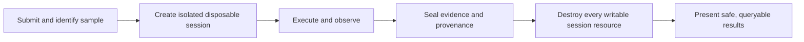

# MalZone Objectives and Principles

## Product objective

Give authorized defenders and researchers a repeatable way to execute an untrusted Windows sample,
observe its behavior in real time, preserve defensible evidence, and return the platform to a known
clean state without exposing the cluster, host, internal network, credentials, or another analysis.
The product experience targets an entirely self-hosted equivalent of an interactive sandbox such as
ANY.RUN: desktop interaction and behavioral views update together while the analysis is running,
and the installation remains useful with all external network links disconnected.

## Users and primary jobs

| Persona | Primary job | Required guardrail |
|---|---|---|
| SOC analyst | quickly understand process, file, registry, DNS, and network behavior | safe defaults, clear confidence/degradation indicators |
| malware researcher | interact with a specimen and inspect raw evidence | bounded console, explicit network mode, auditable exports |
| incident responder | compare an incident sample with observed indicators | immutable hashes, timestamps, provenance, reproducible profile |
| platform operator | maintain templates, capacity, isolation, retention, and recovery | no routine access to sample contents; safe operational tooling |
| security administrator | approve profiles, access, egress, and artifact handling | deny-by-default policy and complete audit history |

## Success criteria

- A submitted sample reaches `Running` within five minutes at p95 when warm capacity is available;
  actual target values are validated against the selected storage and Windows profile.
- An analyst sees lifecycle updates within two seconds and normal telemetry within five seconds at
  p95, without making the UI stream the durable system of record.
- Cancellation and timeout stop execution promptly and converge to zero analysis-scoped resources.
- Replaying the same API request, broker message, or reconcile loop does not create a second VM,
  execute the sample twice, or lose cleanup ownership.
- Every result identifies the sample hash, resolved profile version, golden-image digest/snapshot,
  agent build, network policy, start/stop times, collector health, and artifact hashes.
- Negative tests prove that a compromised guest cannot reach cluster DNS/API, nodes, RFC1918
  networks, cloud metadata, other sessions, object storage, PostgreSQL, NATS, or analyst browsers.

## Engineering principles

- **Assume guest compromise:** guest admin, the Windows kernel, the agent, timestamps, filenames,
  and telemetry can all be malicious or false.
- **Fresh by construction:** create from a read-only approved source; delete the writable copy. Do
  not “clean”, revert, or return a detonated disk to a pool.
- **Narrow mediation:** the guest never owns infrastructure credentials. Relays exchange a tiny,
  versioned, size-limited protocol for one analysis.
- **Separate authority:** PostgreSQL owns user-facing product state; the Kubernetes resource owns
  runtime reconciliation; immutable correlation IDs join them.
- **At-least-once everywhere:** commands and events can repeat. Stable identifiers, sequence
  numbers, content hashes, unique constraints, and idempotent handlers make repeats safe.
- **Policy before reachability:** a profile is resolved and admitted before any VM or egress path is
  created. Unknown modes, templates, destinations, or privileges fail closed.
- **Evidence over claims:** rendered YAML is not proof of enforcement. Run the cluster, attempt the
  forbidden connection, and retain the result.
- **Bounded by default:** duration, CPU, memory, disk, events, artifact bytes, decompression,
  redirects, console time, and egress all have explicit ceilings.
- **Content is quarantined:** output is never rendered inline based only on an extension or MIME
  claim. Downloads use safe names, attachment disposition, authorization, and audit.
- **Replace through contracts:** storage, queue, identity, Windows collectors, and egress providers
  can change behind versioned APIs and conformance suites.

## Functional requirements

1. Ingest a sample without buffering the whole file in the API process; calculate SHA-256, SHA-1,
   MD5, size, media-type observation, and original-name metadata.
2. Resolve an immutable analysis profile containing image, timeout, resources, collectors,
   interaction policy, and network mode.
3. Provision one clean Windows VM, one session identity, two isolated guest networks, one relay,
   and one network gateway/capture context.
4. Deliver exactly the admitted object to the agent, execute it according to the profile, expose a
   bounded browser console, and stream health and behavioral telemetry.
5. Capture process, file, registry, network, DNS, selected event logs, screenshots, execution logs,
   PCAP, and declared optional artifacts such as dropped files or memory.
6. Stop on user request, policy violation, timeout, infrastructure failure, or budget exhaustion.
7. Seal a manifest, hash every artifact, record collector gaps, and make safe projections queryable.
8. Delete or revoke all session resources and expose a terminal outcome only after the cleanup
   inventory is empty.

## Interactive-product capability map

| Analyst capability | Foundation release | Later expansion |
|---|---|---|
| live desktop | in-browser VNC console, keyboard/mouse, explicit clipboard gate | collaboration, session recording, debugger integration |
| live behavior | process tree, timeline, command lines, file/registry/network/DNS events | synchronization/module events, richer causal graph |
| detections | local YARA and Suricata, signed rule versions, analyst verdict | local ATT&CK mapping, family/config extractors, rule-authoring workflow |
| evidence | screenshots, PCAP, event stream, dropped files, logs, hashes | process/full-memory dumps and advanced static inspection |
| automation | file submission, profile presets, autorun and scripted safe interactions | transparent automated-interactivity playbooks |
| reporting | JSON and human-readable local report, IOC export | STIX/MISP/SIEM integrations and comparison across sessions |
| privacy/control | private projects, local storage, local identity, offline execution | multi-cluster cells and policy-controlled local threat-intel sharing |

Clipboard is disabled by default and, when enabled, text-only with size limits and a visible audit
event. Browser-to-guest file drag/drop is not a generic channel: extra files use the same admitted,
hashed, quarantined delivery pipeline as the primary sample. Guest-to-browser clipboard and file
transfer remain disabled.

## Non-functional requirements

| Area | Requirement |
|---|---|
| security | strong isolation is more important than throughput or convenience; offline is default |
| scale | horizontal API/event consumers; concurrency is limited by an admitted capacity controller |
| reliability | reconcile after process/node restarts; no lifecycle step depends on in-memory state |
| performance | telemetry backpressure degrades detail before it destabilizes lifecycle control |
| audit | append-only administrative and user actions with actor, reason, request ID, and result |
| portability | standard Kubernetes/KubeVirt/CSI/S3/OIDC/NATS/PostgreSQL contracts; environment overlays own infrastructure specifics |
| operability | every component has health, readiness, structured logs, metrics, alerts, backup/restore, and upgrade ownership |
| accessibility | keyboard-operable UI, non-color-only status, screen-reader labels, UTC plus local-time display |

## Safety and legal boundaries

MalZone is for authorized defensive analysis. Operators are responsible for sample custody,
software licensing, privacy, jurisdiction, retention, and any controlled-Internet policy. The
platform must not add propagation, phishing, persistence outside the VM, third-party targeting,
credential theft from real environments, or security-control evasion capabilities. Controlled
egress requires an explicit operator policy and an analyst-visible warning; it is never the default.
