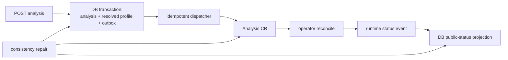
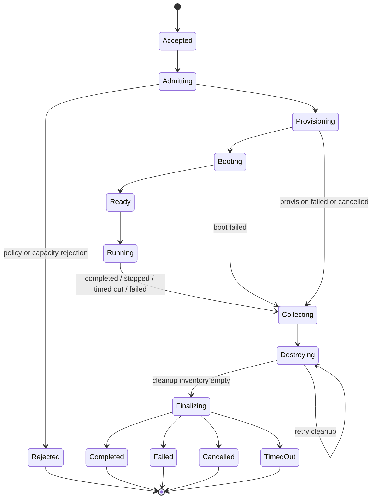
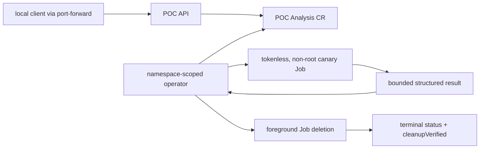

# Runtime Topology and Analysis Lifecycle

## Ownership model

An analysis has two coordinated records:

- PostgreSQL `analysis` is the product record and public API authority. It owns creator, project,
  sample, resolved profile, requested action, timestamps, user-visible outcome, retention, and the
  outbox command.
- Kubernetes `Analysis.malzone.io` is the runtime authority. It owns the desired execution,
  observed resource references, conditions, phase, cleanup inventory, and reconcile generation.

The API never creates a VM directly. In one database transaction it creates the analysis and a
transactional-outbox entry. A dispatcher creates the CR with the same immutable analysis ID and
idempotency key. Status events project CR state back through an internal API/consumer. Repair loops
detect a database record without a CR, a CR without a projection, and stale non-terminal work.



## Lifecycle state machine

Cancellation, timeout, and execution failure set a pending outcome; they do not jump around
collection and cleanup. `CleanupBlocked` is an alerting condition while the operator continues to
retry. The public terminal state is emitted only after the resource inventory is empty and all
analysis credentials are revoked.



### Phase semantics

| Phase | Entry requirement | Controller action | Exit evidence |
|---|---|---|---|
| `Accepted` | committed product record | create/observe CR and finalizer | immutable spec recorded |
| `Admitting` | valid schema | verify project quota, template status, network policy, capacity | admission decision + resolved resource budget |
| `Provisioning` | admitted | create session secret/cert, networks, relay, gateway, clone | every child has owner labels and status reference |
| `Booting` | writable clone ready | start VM and wait for agent handshake | image/profile/agent versions match; relay health current |
| `Ready` | handshake complete | arm capture and create delivery grant | capture started before sample delivery |
| `Running` | sample verified in guest | issue one execution command and enforce budgets | execution result or stop reason recorded |
| `Collecting` | stop reason fixed | stop process/VM as policy requires; flush event/artifact manifests | expected collectors closed or explicitly degraded |
| `Destroying` | collection deadline reached | revoke grants, stop/delete VM, delete PVCs/networks/relay/gateway | cleanup inventory empty; residue query returns none |
| `Finalizing` | zero live resources | seal result manifest and project outcome | immutable result version and audit event |

## Desired stop and outcome precedence

`spec.desiredState` is the only mutable intent field and changes from `Running` to `Stopped`.
Reasons are append-only. If several reasons race, precedence is: policy/security stop, operator
emergency stop, timeout, analyst cancellation, execution failure, success. The first irreversible
security reason is retained even if a later cleanup error occurs. Cleanup health is a separate
condition, not a replacement for the execution outcome.

## Proposed `Analysis` custom resource

The initial CRD is namespaced, version `malzone.io/v1alpha1`. Mutating admission resolves defaults;
validating admission rejects unapproved profile/image/network combinations. Except for
`desiredState`, `spec` is immutable after creation.

```yaml
apiVersion: malzone.io/v1alpha1
kind: Analysis
metadata:
  name: mz-a-01jexample
  namespace: malzone-analysis
spec:
  analysisId: 01JEXAMPLEULID
  projectId: 01JPROJECTULID
  sample:
    sampleId: 01JSAMPLEULID
    sha256: 0123456789abcdef0123456789abcdef0123456789abcdef0123456789abcdef
    objectKey: quarantine/projects/01JPROJECTULID/samples/01JSAMPLEULID
    sizeBytes: 123456
  profile:
    name: windows-11-standard
    version: 3
    goldenSnapshot: win11-standard-2026-08-20
    agentVersion: 0.1.0
    timeoutSeconds: 300
    networkMode: simulated
    interactive: true
    collectors: [process, file, registry, dns, network, eventlog, screenshot, pcap]
  resources:
    cpu: "4"
    memory: 8Gi
    disk: 80Gi
    maxArtifactBytes: 10Gi
    maxEvents: 2000000
  desiredState: Running
status:
  observedGeneration: 1
  phase: Running
  pendingOutcome: ""
  sessionId: 01JSESSIONULID
  startedAt: "2026-08-27T12:00:00Z"
  deadlineAt: "2026-08-27T12:05:00Z"
  resources: []
  cleanupRemaining: []
  conditions: []
```

Object keys are opaque references, not arbitrary user input. Admission verifies that the referenced
sample record belongs to the project and matches the independently computed size and SHA-256.

## Reconciliation and idempotency

Every child object has labels for `analysisId`, `sessionId`, `component`, and `profileVersion`, plus
an owner reference where Kubernetes garbage collection is safe. External objects such as S3
grants are also recorded in `status.cleanupRemaining` before creation or through a create-token
protocol so a crash cannot orphan an untracked resource.

The operator uses deterministic names derived from the opaque analysis ID, server-side apply, and
observed conditions. It never infers completion from absence alone. Each side effect follows:

1. persist intended child reference or idempotency token;
2. create/observe the child;
3. verify its immutable identity and owner labels;
4. persist readiness evidence;
5. advance phase.

Finalization has a deadline for user-visible alerting, not for abandoning cleanup. A cluster-level
reaper independently lists resources by analysis label and repairs stale owners. Removing the
finalizer manually is an audited break-glass action followed by a mandatory residue scan.

## Executable development POC

The first executable slice deliberately proves only Kubernetes API, CRD, reconciliation, bounded
runner, result capture, cancellation, and cleanup mechanics. It is not the production analysis
lifecycle above and must never receive malware. Its `malzone.io/v1alpha1` POC spec accepts only a
short `canary` string, a 1–60 second duration, and a cancellation flag.



The POC API writes the CR directly because PostgreSQL/outbox/dispatcher do not exist yet. The Job
is a Linux control-flow canary, not a VM, has no service-account token, has deny-all networking,
cannot select a command or image through the public request, and runs the same immutable MalZone
binary in `runner` mode. The operator withholds terminal status until the Job API returns not found.
The runner observes SIGTERM through process context, and the Job uses a bounded termination grace
period so cancellation does not wait for the requested canary duration.
Production promotion requires the original PostgreSQL/outbox authority, production CRD, KubeVirt
clone, relay, gateway, finalizer/reaper inventory, identity revocation, and fault-injection evidence.

## Agent session protocol

The Windows agent initiates all management connections. At first boot it receives a one-use
bootstrap secret through an attached read-only configuration medium. The relay exchanges that
secret for a short-lived session certificate bound to analysis ID, session ID, agent build, and
relay audience. The bootstrap secret is then invalid.

Allowed operations are intentionally small:

- `register` and `heartbeat`;
- `get-manifest` and one sequential `get-sample` stream;
- `execution-started` / `execution-finished`;
- bounded event batches with producer sequence numbers;
- chunked artifact upload with declared size and incremental hash;
- `flush` and `goodbye`.

The relay does not expose object-store paths, queue subjects, Kubernetes names, arbitrary URLs,
remote shell, or a generic proxy. Commands are signed, monotonic, expire quickly, and are scoped to
one session. Replays return the previous result without executing a second time.

## Backpressure and degraded analysis

Lifecycle and stop commands have reserved capacity separate from telemetry. Under pressure the
agent batches more aggressively, then drops configured low-priority detail such as repetitive file
reads before it drops process-start, execution, collector-health, or stop events. Every gap emits a
`collector.degraded` event with counters and interval. Artifact and event budgets stop collection
or the analysis according to profile policy; silent truncation is prohibited.
