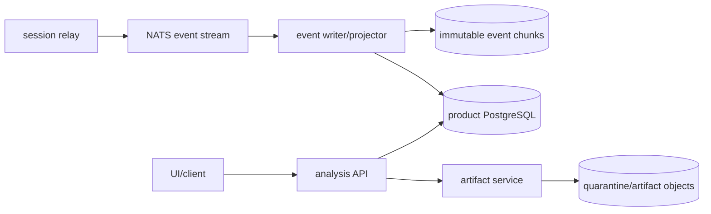

# Contracts, APIs, and Data Ownership

## Contract rules

- Public APIs use `/api/v1`; Kubernetes resources use `malzone.io/v1alpha1`; event envelopes use
  `malzone.event/v1`. Versioning is independent because their compatibility timelines differ.
- JSON schemas/OpenAPI/CRDs are generated and committed. CI validates examples and rejects breaking
  changes unless a versioned migration is present.
- IDs are server-generated UUIDv7 or ULID values. User filenames, hashes, and Kubernetes names are
  not authorization boundaries.
- Create/command APIs accept `Idempotency-Key`. Retries return the original resource or command
  result. State transitions require an expected resource version to prevent stale updates.
- All list APIs use opaque cursor pagination, stable sort order, bounded page size, and project
  authorization before filtering.
- Errors use `application/problem+json` with stable machine codes, request ID, safe detail, and no
  upstream body, object key, token, or sample content.
- Deadlines and cancellation propagate across every synchronous hop. Retries are bounded, use
  jitter, and apply only to idempotent operations.

## Public API surface

The API process never buffers an entire sample or artifact. Large payloads use short-lived,
method-bound upload/download grants issued only after authorization and quota checks.

| Method and route | Purpose | Important semantics |
|---|---|---|
| `POST /api/v1/uploads` | initiate sample upload | declares size/name; returns one-object upload grant |
| `POST /api/v1/uploads/{id}:complete` | finalize and verify upload | server streams object, computes hashes, quarantines mismatch |
| `GET /api/v1/samples/{id}` | sample metadata | no automatic binary download |
| `POST /api/v1/analyses` | create analysis from verified sample/profile | idempotent; stores fully resolved immutable profile |
| `GET /api/v1/analyses` | project-scoped search | filters by state, hash, time, verdict, tag |
| `GET /api/v1/analyses/{id}` | summary and collector health | public state comes from DB projection |
| `POST /api/v1/analyses/{id}:stop` | request stop | idempotent; reason and actor audited |
| `GET /api/v1/analyses/{id}/events` | durable ordered history | cursor by server ingest order; filter by event/process/type |
| `GET /api/v1/analyses/{id}/processes` | process-tree projection | stable process instance IDs, never PID alone |
| `GET /api/v1/analyses/{id}/network` | DNS/flow/HTTP projection | secrets and configured sensitive fields redacted by policy |
| `GET /api/v1/analyses/{id}/artifacts` | artifact metadata | quarantine/disposition/scanner state included |
| `POST /api/v1/artifacts/{id}:download` | controlled download grant | reauthentication/role/reason can be required |
| `POST /api/v1/analyses/{id}/console-ticket` | one-use console authorization | short expiry, user/session binding, interaction audit |
| `GET /api/v1/analyses/{id}/report` | versioned local report | JSON baseline; HTML/PDF rendered in isolated report worker |
| `WS /api/v1/analyses/{id}/stream` | live state/events | resumable from cursor; not authoritative storage |
| `WS /api/v1/analyses/{id}/console` | proxied KubeVirt VNC | no Kubernetes token or VMI address reaches browser |

A compatibility `POST /api/v1/analyses:upload-and-create` convenience endpoint may support small
files, but internally uses the same upload/finalize/create state machine and limits body size.

### Development POC contract

`contracts/openapi/poc-v1alpha1.openapi.json` is a separate, explicitly non-production contract.
It uses `/api/v1alpha1`, stores state only in a namespace-scoped POC `Analysis` CR, has no OIDC or
project boundary, and accepts only bounded `sample.kind=canary` text. It exists to exercise API →
CRD → operator → cleanup behavior on a development cluster. It does not implement, narrow, or
supersede the `/api/v1` public surface above and cannot be promoted without a new synchronized
contract and security review.

Catalog/image-build routes and report/export/webhook/integration routes are specified in
[Software Catalog and Windows Image Composition](05-software-catalog-image-composition.md) and
[API, Identity, Observability, and Workflow Integrations](06-api-identity-observability-integrations.md).

## Event envelope

Events are accepted at least once and ordered by relay ingest sequence, not by an untrusted Windows
clock. Each producer has a monotonic `producerSequence`; the relay assigns `ingestSequence` after
validating identity, size, schema, and budget. A unique constraint on
`(analysisId, producer.id, producer.sequence)` deduplicates replay.

```json
{
  "specversion": "malzone.event/v1",
  "id": "01JEVT...",
  "type": "process.started",
  "analysisId": "01JANALYSIS...",
  "sessionId": "01JSESSION...",
  "projectId": "01JPROJECT...",
  "producer": {
    "id": "windows-agent",
    "version": "0.1.0",
    "sequence": 1842
  },
  "occurredAt": "2026-08-27T12:00:03.145Z",
  "observedAt": "2026-08-27T12:00:03.201Z",
  "ingestSequence": 1920,
  "schema": "process.started/1.0.0",
  "data": {
    "processInstanceId": "01JPROCESS...",
    "pid": 4120,
    "parentProcessInstanceId": "01JPARENT...",
    "image": "C:\\Users\\analyst\\sample.exe",
    "commandLine": "...",
    "integrity": "medium",
    "userSid": "S-1-5-21-..."
  }
}
```

Event payloads are untrusted data. The server normalizes encoding, bounds every string/array, stores
raw accepted envelopes in compressed immutable chunks, and escapes all UI output. Corrections are
new events; stored evidence is never silently rewritten.

Initial schemas cover:

- `analysis.phase-changed`, `analysis.stop-requested`, `collector.health`, `collector.degraded`;
- `process.started`, `process.exited`, `process.module-loaded`;
- `file.created`, `file.modified`, `file.deleted`, `file.renamed`;
- `registry.key-*`, `registry.value-*`;
- `network.flow`, `dns.query`, `http.request`, `tls.handshake`;
- `detection.matched`, `screenshot.captured`, `artifact.declared`, `artifact.sealed`;
- `interaction.keyboard`, `interaction.pointer`, `interaction.clipboard`, `interaction.file-delivery`.

## Data ownership

No service reads another service's database schema or bucket prefix directly. Database roles,
object policies, and network policy reinforce these ownership boundaries.



| Owner | Authoritative data | Access path |
|---|---|---|
| analysis API | users/projects, samples, analyses, resolved profiles, tags, comments, requested retention | public/internal API |
| lifecycle projector | runtime status projection and resource-free terminal proof | internal event consumer/API |
| event pipeline | event chunks, ingest cursors, projection checkpoints | event/query API |
| artifact service | artifact manifest, hashes, disposition, scanner state, retention/legal hold | artifact API and brokered grants |
| detection service | rule bundles, versions, signatures, matches, ATT&CK mappings | detection API/events |
| catalog service | package manifests/review state, recipes/resolution, license references | catalog/image API |
| image-build/promotion service | build state, provenance, candidate/promoted/revoked images | build API and Kubernetes build resources |
| report/export service | report versions, export jobs/objects, redaction and expiry | report/export API |
| webhook/integration service | subscriptions, delivery attempts/checkpoints and connector configuration | webhook/adapter API |
| operator | `Analysis` status and Kubernetes child inventory | Kubernetes API only |

## PostgreSQL logical model

| Entity | Key properties |
|---|---|
| `project` | isolation unit, policy profile, retention, quota |
| `sample` | opaque ID, project, SHA-256/SHA-1/MD5, size, observed type, quarantine key, custody timestamps |
| `analysis` | sample, creator, immutable resolved profile JSON, requested state, projected phase/outcome, version |
| `analysis_runtime` | CR UID, session ID, image/snapshot/agent versions, deadlines, cleanup proof |
| `process_instance` | stable ID, PID, parent stable ID, image, command line, first/last sequence |
| `network_flow` | process instance, endpoints, protocol, byte counts, first/last sequence |
| `dns_observation` | process instance, query, type, answers, response code, sequence |
| `artifact` | logical type, size, SHA-256, object reference, disposition, encryption/retention metadata |
| `detection_match` | rule bundle/version/rule ID, event/process/artifact reference, severity/confidence |
| `software_package_version` | project/curated scope, exact version/revision, manifest digest, review/license/artifact references |
| `windows_image_recipe` | authored/resolved immutable recipe, digest, compatibility and project scope |
| `image_build` / `image_version` | phase, builder inventory, provenance/validation, promotion/revocation |
| `export_job` | report version, format/options/redaction, phase, output hash/size/expiry |
| `webhook_subscription` / `delivery` | endpoint policy, event filters, secret reference, attempts/checkpoint/dead letter |
| `audit_event` | actor, action, target, reason, request ID, source, result, timestamp |
| `outbox` | aggregate ID, command type/version, payload, attempts, dispatch timestamp |

SHA-256 has a unique index only within the intended project/deduplication domain. Public resources
use opaque IDs so a hash cannot be used to discover another project's possession of a sample.

## Object-storage layout

Object names are generated server-side and never contain original filenames.

```text
quarantine/<project-id>/samples/<sample-id>/content
events/<project-id>/<analysis-id>/<chunk-sequence>.ndjson.zst
artifacts/<project-id>/<analysis-id>/<artifact-id>/content
manifests/<project-id>/<analysis-id>/<result-version>.json
reports/<project-id>/<analysis-id>/<report-version>/report.json
exports/<project-id>/<export-id>/content
software/<scope-id>/<package-id>/<version>/<revision>/<artifact-id>
image-provenance/<scope-id>/<image-version-id>/provenance.json
```

Buckets or access points separate quarantine, event, artifact, and report policies. Production
enables encryption, versioning/object lock where required, lifecycle retention, access logging, and
an independently administered backup target. Pre-signed grants are single-object, method-bound,
short-lived, size-constrained where supported, and never written to logs.

## Artifact manifest and chain of custody

The final manifest includes analysis/sample/profile/session identity, every artifact's hash and
size, event-chunk hash chain, collector versions and health, all clock offsets, network mode, rule
bundle versions, interactions, stop reason, and cleanup proof. The artifact service signs the
canonical manifest using an environment-owned key. This proves platform custody after ingestion;
it does not make hostile guest claims truthful.

## Retention and deletion

Retention is project policy resolved at analysis creation. Metadata, sample, events, artifacts,
reports, audit, and backups have explicit and possibly different schedules. Deletion is a durable
workflow that tombstones public access, revokes grants, deletes eligible object versions, records
legal-hold exceptions, and emits proof. Hash deduplication never causes deletion of one project to
remove another project's authorized copy.
