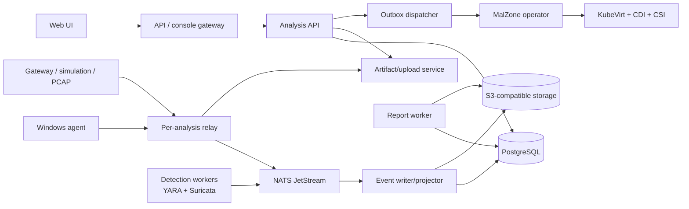

# Components and Technology Decisions

## Component map



## Responsibilities

| Component | Responsibilities | Explicit exclusions |
|---|---|---|
| web UI | upload, profile selection, console, live process/timeline/network views, artifacts, reports, administration | direct Kubernetes/object-store access; active-content preview |
| API/console gateway | OIDC validation, project RBAC, quotas, request IDs, WebSocket fan-out, VNC subresource proxy | lifecycle decisions, sample parsing, Kubernetes token disclosure |
| analysis API | product state, resolved profiles, upload/analysis commands, public queries, audit | raw VM creation; high-volume raw event storage |
| dispatcher | deliver committed outbox commands to Kubernetes idempotently | product decisions or retries without bounds |
| operator | CR lifecycle, child resources, deadlines, finalizer, cleanup/reaper | user identity, artifact interpretation, public API |
| session relay | terminate agent mTLS, enforce session protocol/budgets, broker sample/artifacts/events | packet routing, generic proxying, shared infrastructure credentials |
| Windows agent | heartbeat, controlled execution, collectors, screenshots, artifact chunks | infrastructure credentials, lifecycle authority, claims of trustworthiness |
| network gateway appliance | DHCP/DNS, offline/simulated/controlled routing, packet capture, optional local TLS intercept | cluster/internal routes, arbitrary VPN/TOR, implicit Internet access |
| event writer/projector | validate/deduplicate events, write immutable chunks, build query models | lifecycle authority or modification of raw evidence |
| detection workers | versioned local YARA/Suricata/behavior rules and matches | blocking lifecycle unless profile explicitly promotes a policy rule |
| artifact service | quarantine, hashing, grants, manifests, retention, controlled downloads | trusting extension/MIME; rendering in the main API/UI origin |
| report worker | build deterministic JSON and isolated HTML/PDF reports | network access or execution of artifact content |

## Technology baseline

Versions are pinned in deployment files only after a compatibility test. This design names
capabilities rather than claiming that arbitrary current releases interoperate.

| Concern | Baseline | Reason |
|---|---|---|
| orchestration | Kubernetes | declarative reconciliation, scheduling, quotas, policy ecosystem |
| virtualization | KubeVirt `VirtualMachine`/`VirtualMachineInstance` | Windows/KVM isolation and Kubernetes lifecycle integration |
| image cloning | KubeVirt clone/snapshot API + CSI `VolumeSnapshot`; CDI for image import | approved golden source with a fresh writable volume per run |
| secondary networking | Multus plus an environment-selected L2/VLAN/VXLAN CNI | guest can omit the pod network and attach isolated analysis networks |
| backend/operator/relay | Go | Kubernetes/controller-runtime ecosystem, static binaries, shared contracts, Windows cross-build |
| Windows agent | Go with narrow native Windows/ETW/Event Log bindings | single signed service binary and shared protocol code; collectors remain replaceable |
| frontend | TypeScript + React/Next.js | mature real-time UI and self-hosted server/static deployment options |
| metadata | PostgreSQL | transactions, outbox, JSON profile snapshots, mature backup/HA options |
| messaging | NATS JetStream | lightweight local operation, durable consumers, replay, subject permissions, backpressure |
| bulk storage | S3 API; MinIO is the development/default local option | portable object contract, large immutable objects, scoped grants |
| identity | local or enterprise OIDC; Keycloak is one self-hosted option | standards-based SSO without a cloud dependency |
| policy | Kubernetes admission/RBAC plus a local policy engine when required | fail-closed profile/egress/template decisions and auditable rules |
| observability | Prometheus/OpenMetrics, OpenTelemetry, JSON logs, Grafana | vendor-neutral and fully local operation |
| detections | YARA/YARA-X-compatible scanner, Suricata, signed local behavior rules | familiar defensive rule formats and offline rule operation |
| network simulation | dedicated local gateway using INetSim-compatible services and controlled DNS/HTTP/TLS components | deterministic offline responses without exposing infrastructure |

Replacing a baseline requires an architecture decision record and the same contract, isolation,
failure, backup, and negative-test evidence.

In production, the per-analysis network gateway is a small, signed Linux KubeVirt appliance VM with
no pod network. Its interfaces attach to the session detonation network, the relay-management
network, and—only for `controlled` mode—a separate sandbox-egress network. This avoids running a
privileged packet-routing/capture pod across the hostile network and Kubernetes pod network. An
environment-owned physical/virtual network appliance with per-session VRF/VNI isolation is an
equivalent provider. A privileged gateway pod is development-only and proves no isolation claim.

## Windows golden image

The template is a build artifact, not a manually curated pet VM. An offline image pipeline:

1. starts from licensed installation media whose hash is allow-listed;
2. applies a pinned unattended install, updates, drivers, VirtIO/QEMU guest agent, and local policy;
3. installs the signed MalZone agent and approved collector/tool bundle;
4. configures PowerShell Script Block/Module/Transcription policy, Windows Event Log sizing,
   Sysmon if selected, crash/memory policy, time synchronization, and dedicated analysis user;
5. removes builder credentials, update caches, shared folders, remote-management listeners, and
   package-manager secrets;
6. runs vulnerability, malware, configuration, network, and agent self-tests;
7. shuts down cleanly, seals the disk, creates an offline snapshot, and signs a manifest containing
   every installer/tool/rule/configuration hash;
8. promotes the snapshot only after two-person review and a canary detonation/cleanup test.

Installed research utilities can include Sysinternals, Sysmon, event-log tooling, PowerShell
logging, Wireshark/tshark, local YARA tooling, and the custom agent. Licenses and redistribution
rights are verified before inclusion. Interactive desktop convenience settings are profile-owned;
security weakening is documented, bounded to the disposable guest, and never applied to hosts.

The guest contains no access to Windows domain credentials, corporate activation services, shared
clipboard, mapped drives, printers, USB passthrough, host time services beyond the declared source,
or internal update servers. Production image updates are built offline and promoted as a new
immutable version; a running analysis never changes image version.

## Windows agent and collectors

The agent runs as a Windows service with a small coordinator and independently health-reported
collectors. A collector failure degrades the report; it cannot silently mark the analysis clean.

| Collector | Preferred source | Notes |
|---|---|---|
| process | ETW plus process snapshot reconciliation | stable process instance ID joins PID with boot/start identity |
| file | ETW/minifilter or approved Sysmon events | recursive storm limits; preserve path and content-hash provenance |
| registry | ETW/approved event source | normalize hive/view; cap data values and redact configured secrets |
| network/DNS | ETW/WFP metadata plus gateway observations | guest data is correlated with independent gateway capture |
| Windows events | Event Log subscriptions | explicit channel allow-list and bookmark/checkpoint |
| screenshot | desktop capture in user session | rate/budget limits; hostile image decoder is isolated server-side |
| execution | dedicated launcher | one command, explicit user/integrity/session, wall-clock and child policy |
| artifact | declared file/memory/log streams | stream hash and chunk; never load large artifacts wholly in memory |

Kernel drivers materially expand risk and maintenance. The foundation starts with signed Microsoft
or well-established collector paths and user-mode agent code. A custom driver needs its own threat
model, signing/upgrade/recovery plan, fuzzing, supported-Windows matrix, and image-promotion gate.

## Interactive console

KubeVirt VNC is proxied through the edge using a short-lived console ticket and tightly scoped
operator-side permission. The browser never receives `kubeconfig`, a service-account token, VMI IP,
or direct relay address. The proxy enforces one controller or an explicit collaboration policy,
idle/absolute timeouts, frame/keyboard/pointer limits, and immutable interaction audit.

The main analysis screen keeps these views synchronized to the same ingest cursor:

```text
+----------------------+--------------------------------+----------------------+
| sample / phase / time| interactive Windows desktop    | detections / verdict |
| profile / net / stop | keyboard + pointer controls    | collector health     |
+----------------------+--------------------------------+----------------------+
| process tree / graph | ordered timeline               | event detail         |
+----------------------+--------------------------------+----------------------+
| network/DNS/HTTP     | files / registry / modules     | artifacts / PCAP     |
+----------------------+--------------------------------+----------------------+
```

When live events fall behind, the UI shows the durable cursor and gap rather than pretending the
screen is current. Console availability never controls lifecycle; an analysis continues or times
out if the browser disconnects.

## Detection and enrichment

Detections are deterministic and local by default:

- pre-execution static metadata and YARA scanning occur in an isolated worker;
- Suricata evaluates captured traffic or a controlled live feed from the gateway;
- behavior rules consume normalized events and can map to pinned local ATT&CK content;
- IOC extraction retains source event/artifact and normalization method;
- rules are signed, versioned, staged, canaried, and recorded in the result manifest.

Threat-intelligence, SIEM, MISP, or cloud reputation integrations are optional adapters. They are
disabled in the air-gapped profile, never receive samples by default, minimize submitted fields,
own their credentials, and record every disclosure decision.

Automated interactivity is a later local playbook engine, not opaque AI control of the desktop. Each
action declares its trigger, bounds, resulting keyboard/pointer/input events, and rationale so an
analyst can replay what automation did. Model-assisted summaries are optional local adapters and
must cite underlying evidence; they never replace the deterministic report.

## Repository target structure

```text
MalZone/
├── api/                         # public/internal API services
├── cmd/                         # Go entry points
├── controller/                  # Analysis reconciler and reaper
├── agent/                       # Windows service and collectors
├── relay/                       # per-analysis protocol endpoint
├── frontend/                    # interactive analyst UI
├── contracts/
│   ├── crd/                     # generated and source CRD types
│   ├── openapi/                 # public/internal API
│   └── events/                  # envelope and event JSON schemas
├── internal/                    # shared Go packages; no cross-service DB access
├── migrations/                  # PostgreSQL migrations by owning service
├── deploy/
│   ├── helm/malzone/            # installable chart
│   ├── profiles/                # dev, offline, controlled-egress, production
│   ├── kubevirt/                # VM preferences/templates/examples
│   ├── networking/              # NAD/gateway/provider-specific overlays
│   └── policies/                # RBAC, admission, network, pod security
├── vm/
│   ├── packer/                  # reproducible image pipeline
│   ├── scripts/                 # Windows provisioning scripts
│   └── manifests/               # signed image/tool manifests
├── detections/                  # schemas and development-only rules
├── docs/
│   ├── design/
│   ├── operations/
│   ├── security/
│   └── prompts/
├── tests/
│   ├── unit/
│   ├── contract/
│   ├── integration/
│   └── isolation/
└── Makefile
```
