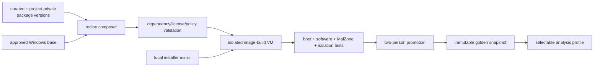
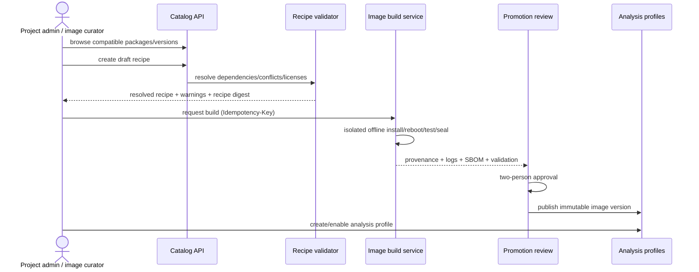
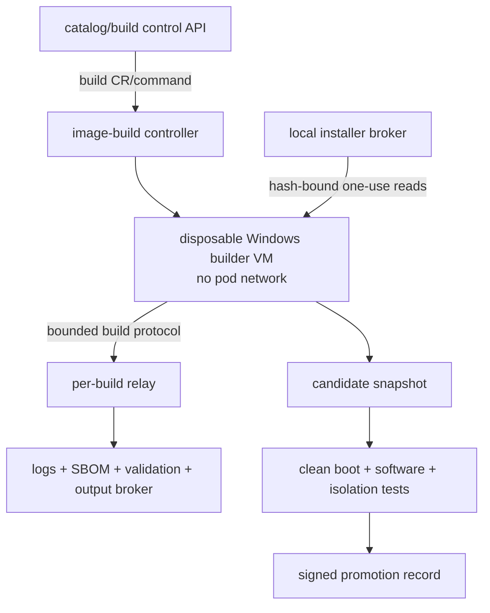

# Software Catalog and Windows Image Composition

## Decision

MalZone provides a curated software catalog and project-private catalog. Authorized clients choose
exact approved package versions to create an immutable `WindowsImageRecipe`. MalZone builds,
validates, and promotes a new golden image from that recipe before any malware analysis uses it.

Software is never fetched from the public Internet or installed opportunistically during an
analysis. This keeps images reproducible, avoids leaking build/package credentials to a compromised
guest, and prevents a malware session from influencing package installation.



## Three separate objects

These concepts must not be collapsed:

| Object | Owns | Does not own |
|---|---|---|
| `SoftwarePackageVersion` | one exact installer revision, hashes, install/detect rules, dependencies, license and security review | base OS, VM resources, network mode, analysis timeout |
| `WindowsImageRecipe` | exact base image, mandatory platform bundle, selected package pins, locale/user settings, build/validation policy | runtime network/resources/collectors/timeout |
| `AnalysisProfile` | promoted image digest/snapshot plus runtime CPU/RAM/disk, collectors, network, interaction and evidence budgets | mutable package selection or build credentials |

An analyst starts an analysis from a promoted profile. A project administrator or image curator
composes/builds images. This avoids granting ordinary sample-submitters a path to execute arbitrary
installer scripts in the image supply chain.

## Catalog scopes

| Scope | Owner | Visibility | Typical contents |
|---|---|---|---|
| curated | platform image-curator team | all authorized projects | browsers, runtimes, archive/PDF/mail/Office-compatible tools, research utilities |
| project-private | one project | that project only | licensed commercial software, customer line-of-business app, private plugin/add-on |
| platform bundle | MalZone release | locked; not user-removable | agent, VirtIO/QEMU guest support, collector configuration, trust roots, health tooling |

Curated does not imply that MalZone may redistribute a vendor installer. Catalog entries can require
the operator/client to provide a licensed installer into the local mirror before the version becomes
available. Project-private package existence, name, hash, license, recipe, and build status are not
visible across projects.

## Package manifest contract

The canonical machine-readable schema is
[`SoftwarePackageVersion v1alpha1`](../../../../contracts/schemas/software-package-version-v1alpha1.schema.json).
One manifest describes one immutable vendor version plus MalZone packaging revision.

```yaml
apiVersion: malzone.io/v1alpha1
kind: SoftwarePackageVersion
metadata:
  packageId: example-browser
  displayName: Example Browser
  version: 1.0.0
  revision: 1
  visibility: curated
spec:
  publisher: Example Publisher
  architectures: [x64]
  supportedWindows:
    - product: windows-11
      buildMin: 22621
  source:
    artifactId: 01JEXAMPLEINSTALLER0000000000
    sha256: 1111111111111111111111111111111111111111111111111111111111111111
    sizeBytes: 104857600
    fileName: example-browser-1.0.0-x64.msi
    mediaType: application/x-msi
    authenticode:
      required: true
      allowedSubjects: [CN=Example Publisher]
      allowedThumbprints: [AAAAAAAAAAAAAAAAAAAAAAAAAAAAAAAAAAAAAAAA]
  installer:
    type: msi
    arguments: [/qn, /norestart]
    context: system
    timeoutSeconds: 900
    successExitCodes: [0, 3010]
    reboot: allowed
  detection:
    - type: file
      target: C:\Program Files\Example Browser\browser.exe
  validationSuites: [browser-launch-offline-v1]
  license:
    category: freeware
    redistributionAllowed: false
    acceptanceRequired: true
    licenseReference: catalog-license/example-browser/1.0.0
    activation: none
  securityReview:
    risk: standard
    requiresAdmin: true
    addsService: false
    addsKernelDriver: false
    requestedExceptions: []
```

The manifest contains no mutable download URL, credentials, inline script, environment-variable
secret, `latest`, or version range. Installer arguments are an array passed directly to a process,
not a shell-concatenated command. Optional hooks reference separately mirrored and hashed script
bundles; any hook makes the review at least elevated risk.

### Version semantics

- `version` is the upstream software version exactly as packaged.
- `revision` increments when MalZone metadata, arguments, detection, hooks, license, validation, or
  packaging changes without changing the upstream binary version.
- Published `(packageId, version, revision)` records are immutable. Corrections create a revision.
- The source object is accepted only when server-computed SHA-256/size and required Authenticode
  identity match the manifest.
- Dependency and conflict edges pin exact versions/revisions. Resolution produces a deterministic
  acyclic install order or fails; it never selects a newer version implicitly.

## Image recipe contract

The canonical schema is
[`WindowsImageRecipe v1alpha1`](../../../../contracts/schemas/windows-image-recipe-v1alpha1.schema.json).
The recipe pins the licensed Windows base and required MalZone platform bundle separately from
selectable client software.

```yaml
apiVersion: malzone.io/v1alpha1
kind: WindowsImageRecipe
metadata:
  recipeId: windows-11-browser-lab
  displayName: Windows 11 Browser Lab
  revision: 1
  visibility: curated
spec:
  baseImage:
    imageId: windows-11-enterprise-x64
    version: 2026.08.1
    digest: 2222222222222222222222222222222222222222222222222222222222222222
  platformBundle:
    version: 0.1.0
    digest: 3333333333333333333333333333333333333333333333333333333333333333
  packages:
    - packageId: example-browser
      version: 1.0.0
      revision: 1
      settings:
        disableAutoUpdate: true
        suppressFirstRun: true
  osSettings:
    locale: en-GB
    uiLanguage: en-GB
    timezone: GMT Standard Time
    keyboardLayouts: ['0809:00000809']
    defaultBrowserPackageId: example-browser
  analysisUser:
    privilege: local-admin
    autoLogon: true
  buildPolicy:
    network: offline-mirror-only
    updates: pinned-in-base-image
    sysprep: preserve-profile
    failOnUnexpectedReboot: true
    maxDurationSeconds: 7200
  validationSuites:
    - malzone-platform-health-v1
    - browser-launch-offline-v1
    - guest-no-secret-residue-v1
```

Canonical JSON serialization of the fully resolved recipe produces a recipe digest. The build
record stores both user-authored and resolved recipes so dependency insertion or policy defaults are
visible. Two projects only share a cached output if every package and license scope permits it;
project-private inputs always produce project-private images.

## Client experience



The UI shows compatibility, installed footprint, licenses/acceptance, kernel drivers/services,
reboot needs, known conflicts, build time estimate, validation state, and image lifecycle. Fast-path
users choose an existing promoted profile. Custom composition is asynchronous and can take minutes;
it does not delay a live analysis while installing packages.

## Catalog and image-build API

All routes are project-scoped, OpenAPI-described, cursor-paginated where listed, and covered by
idempotency/audit rules from the API design.

| Route | Purpose | Minimum role |
|---|---|---|
| `GET /api/v1/software-packages` | list visible packages compatible with filters/base image | viewer |
| `GET /api/v1/software-packages/{packageId}/versions` | exact versions/revisions, license and review state | viewer |
| `POST /api/v1/software-package-uploads` | initiate project-private installer upload | project-admin |
| `POST /api/v1/software-package-uploads/{id}:complete` | hash/AuthentiCode/quarantine completion | project-admin |
| `POST /api/v1/software-packages` | submit project-private manifest for review | project-admin |
| `POST /api/v1/image-recipes:resolve` | validate/resolve without persisting | project-admin |
| `POST /api/v1/image-recipes` | create immutable recipe revision | project-admin/image-curator |
| `GET /api/v1/image-recipes/{id}` | recipe, resolution, compatibility and lifecycle | viewer |
| `POST /api/v1/image-builds` | idempotently request build of resolved recipe | project-admin/image-curator |
| `GET /api/v1/image-builds/{id}` | phase, safe logs, provenance and validation | viewer |
| `POST /api/v1/image-builds/{id}:cancel` | cancel and clean build resources | project-admin/image-curator |
| `POST /api/v1/image-versions/{id}:approve` | one promotion approval; actor cannot be builder/requester alone | image-curator |
| `POST /api/v1/image-versions/{id}:revoke` | prevent new analyses and record reason | security-admin |
| `GET /api/v1/image-versions` | list promoted/deprecated/revoked images | viewer |

Package submission does not make a version selectable. States are
`Uploaded → Verified → InReview → Approved → Deprecated/Revoked` or `Rejected`. Image builds are
`Draft → Resolved → Queued → Building → Rebooting → Testing → Sealing → AwaitingApproval →
Promoted`, with `Failed`, `Cancelled`, and `Revoked` outcomes. All failed/cancelled paths delete
builder VMs, writable disks, networks, credentials, and temporary objects.

## Image-build trust zone

Installer code is privileged and can be malicious, including customer-supplied “legitimate”
software. The build system is therefore a separate hostile-code execution zone, not a Kubernetes
Job that runs installers in a control-plane container.



Build VMs run on dedicated tainted builder nodes or a separate build cluster/network. They have no
analysis samples, production database/queue/object credentials, corporate network, Internet route,
or reusable license secret. A build relay mirrors the analysis relay pattern. Installer objects are
delivered from a local immutable mirror by exact artifact ID/hash.

The builder may reboot multiple times under a monotonic build plan. A build agent records each
process invocation, exit code, reboot, detection check, file/registry/service delta summary, and
package result. It cannot change the resolved recipe. Unexpected process/reboot/network behavior
fails or quarantines the candidate according to policy.

## Licensing and activation

- The operator/client is responsible for Windows and application license/redistribution rights.
- Catalog metadata records license category, evidence reference, acceptance, visibility, and
  activation method. It does not store license text as an unreviewed executable payload.
- Commercial installers can be project-private and never copied into a global cache/catalog.
- License keys and activation credentials live in a local secret authority and are resolved by an
  opaque `activationProfileRef`; they never appear in manifests, logs, recipes, snapshots, or APIs.
- `build-time-local` activation can reach only a dedicated local activation broker during build.
  The resulting image must pass a secret-residue test and must not need access to corporate KMS,
  directory, or license servers during analysis.
- If a vendor license cannot be used safely without a reusable secret or corporate connection, that
  software/image is unsupported until an isolated licensing design is approved.

## Package classes and risk

The initial curated catalog can provide reviewed definitions for categories, subject to local
installer/licensing availability:

- browsers and pinned browser versions;
- archive/compression tools;
- PDF/document/email viewers and Office-compatible or licensed Office profiles;
- Java/.NET/Visual C++ and other common runtimes;
- media/image viewers;
- developer/script runtimes needed to trigger samples;
- Sysinternals/Sysmon, Wireshark/tshark, YARA-compatible tools, and approved research utilities.

The initial catalog namespace is designed around stable package families; exact selectable versions
exist only after their own manifest, installer import, license review, build and validation:

| Example catalog ID | Family | Availability rule |
|---|---|---|
| `microsoft-edge`, `google-chrome`, `mozilla-firefox` | browsers | operator imports exact enterprise/offline installer permitted by vendor |
| `microsoft-office`, `libreoffice`, `adobe-reader` | documents/PDF | commercial entries are BYOL/project-private unless redistribution is approved |
| `dotnet-runtime`, `java-runtime`, `python`, `vcpp-redist` | runtimes | architecture/OS build and side-by-side compatibility explicitly modeled |
| `seven-zip`, `winrar` | archives | exact silent install and license scope; archive parsing remains quarantined |
| `thunderbird`, approved mail client profiles | email | no real account credentials or corporate mail connectivity in image |
| `sysinternals`, `sysmon`, `wireshark`, `yara`, `x64dbg` | analysis tools | platform/security review; drivers/debuggers may be elevated risk |

These IDs are design namespaces, not a claim that MalZone currently ships or may redistribute the
named products. The catalog API returns only versions whose local installer, license, compatibility,
review and promotion prerequisites are satisfied for the requesting project.

Packages adding kernel drivers, services, browser extensions, debuggers, security-control
exceptions, custom roots, packet filters, or build hooks are elevated/driver risk and require a
major security review. The mandatory MalZone platform bundle cannot be removed, downgraded, or
overridden by a package.

## Provenance and promotion

Every candidate image produces a signed provenance record containing:

- recipe and resolved-recipe digests;
- base media/image/version/digest and Windows build/edition/architecture;
- platform bundle, agent, VirtIO/QEMU, collector and rule versions/digests;
- every package manifest/version/revision, artifact/hook hash, Authenticode result, license scope;
- deterministic install order, arguments (excluding secrets), exit codes, reboots, timings;
- builder/controller image digests and build node/cluster attestation reference;
- SBOM/inventory, Windows update state, services/drivers/tasks/roots added;
- validation suite versions/results and known exceptions;
- candidate snapshot/PVC identity/digest, promotion actors/time, signature, and expiry/review date.

Promotion requires two distinct authorized approvals for elevated images, successful clean boot,
package detection/launch tests, MalZone agent/collector health, no-secret residue, no unexpected
egress, VNC usability, snapshot clone, and complete analysis cleanup canary. Revocation blocks new
analyses immediately; active runs follow explicit security policy and are audited. Rollback selects
a previous promoted immutable image.

## Catalog maintenance

New vendor releases do not mutate existing entries. A curator imports installer bytes into the local
mirror, verifies provenance/signatures, creates a new manifest, runs builds/tests, and promotes
explicitly. There is no automatic “track latest” in production. A separately networked update
staging system may discover metadata, but production import is an audited offline transfer.

Catalog APIs expose `available`, `deprecated`, `revoked`, `license-required`, `incompatible`, and
`installer-missing` states honestly. Retention preserves manifests/provenance for every retained
analysis even after installers/images are removed. Garbage collection considers analysis/report
retention, legal hold, project visibility, base/package lineage, rollback window, and backup.

## Failure and negative tests

- wrong/missing hash, size, Authenticode identity, package/project scope, or license acceptance;
- mutable URL, version range/`latest`, duplicate pin, dependency cycle/conflict, unsupported OS/build;
- manifest argument injection, path traversal, malicious hook, archive bomb, unexpected child/network;
- installer timeout/hang/crash/reboot loop, disk exhaustion, controller/relay/node restart;
- attempted access from builder to Internet, corporate/internal/analysis networks, Kubernetes, S3,
  NATS, PostgreSQL, or another build/project;
- platform bundle removal/downgrade, agent/collector disablement, unexpected service/driver/root;
- secret/license residue in disk, registry, logs, pagefile, crash dump, environment, build artifacts;
- unapproved snapshot selection, revoked image analysis, cross-project cache/image disclosure;
- cancel/fail at every build phase followed by zero builder resource/credential/network residue.

## Implementation status

The JSON schemas and fictional examples are implemented repository contracts. Catalog API, local
mirror, resolver, build controller/relay/agent, promotion service, UI, and runtime image selection
remain designed until executable code, packaging, and automated evidence exist in the conformance map.
