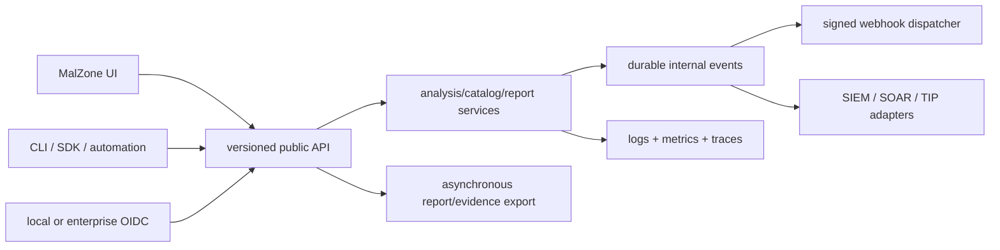
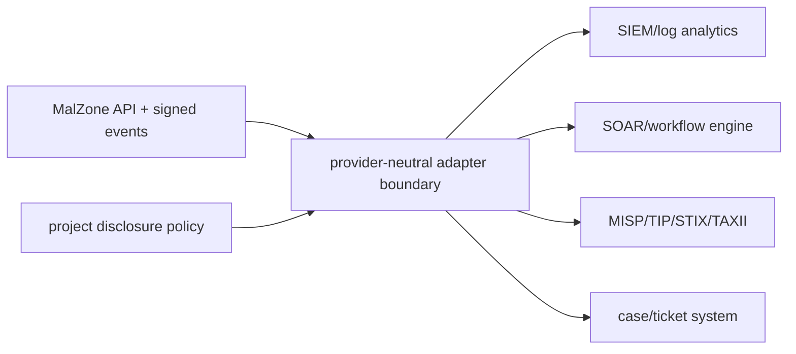

# API, Identity, Observability, and Workflow Integrations

## API-first decision

Every analyst UI operation and external integration uses the same versioned service contracts. The
web UI is a client, not a privileged back door. Submissions, lifecycle commands, live events,
queries, reports, evidence export, catalog/image composition, administration, and audit all have
documented APIs with project-scoped authorization.

## Contract and compatibility standards

- HTTP APIs use committed OpenAPI 3.1 under `/api/v1`; breaking changes require `/api/v2` or an
  explicitly time-bounded compatibility layer.
- Live analysis/event updates use authenticated resumable WebSockets with durable HTTP history. A
  disconnected UI/integration resumes from an opaque ingest cursor.
- Long operations—image builds, exports, deletions, reprocessing—return `202 Accepted` plus an
  operation resource; clients poll or subscribe instead of holding a request open.
- Create/command routes require `Idempotency-Key`; resources carry strong ETags/resource versions;
  list APIs use opaque stable cursors.
- Errors use `application/problem+json` with stable machine codes and safe request IDs.
- JSON is the baseline. Downloads/exports use declared content types, hashes, sizes, dispositions,
  expiry, and authorization; unbounded archive construction in the API process is prohibited.
- Generated SDKs are optional outputs of committed OpenAPI, never the source of contract truth.

## Identity and SSO

The canonical human identity protocol is OIDC Authorization Code with PKCE. The default local,
air-gapped profile can deploy or bind to a self-hosted IdP such as Keycloak. Enterprise OIDC is a
configuration-ready replacement. SAML, LDAP, or Active Directory integration is brokered through
the organization's IdP; MalZone does not implement separate password/SAML stacks in each service.

The edge verifies exact issuer, audience, signature algorithm, expiry, nonce/state/PKCE, and required
claims. Project/role membership comes from MalZone policy bound to a stable verified subject; it is
not trusted from arbitrary caller headers. IdP/JWKS unavailability fails new authentication closed
while already verified sessions follow short, explicit cache/expiry policy.

Machine integrations use OAuth2 client credentials or an environment workload-identity exchange,
with one client per integration, exact audience, short expiry, narrow scopes, project allow-list,
quota, optional mTLS, rotation, and revocation. Personal long-lived API keys are not the production
default. Initial scopes include:

- `samples.write`, `analyses.create/read/stop/interact`;
- `events.read`, `reports.read/export`, `artifacts.metadata/read`;
- `catalog.read`, `images.build/read`;
- `webhooks.manage`, `audit.read`, `admin.profiles`.

Artifact content, console interaction, controlled egress, image promotion, and security policy use
separate high-risk scopes and may require user reauthentication/approval. A token valid for report
metadata is not automatically valid for malware artifact download.

## Report and evidence API

The deterministic result manifest/report is available independently of the UI:

| Route | Purpose |
|---|---|
| `GET /api/v1/analyses/{id}/report` | canonical versioned JSON report with evidence references |
| `POST /api/v1/analyses/{id}/exports` | start an asynchronous export job |
| `GET /api/v1/exports/{id}` | state, format, size/hash, expiry, errors |
| `POST /api/v1/exports/{id}:download` | short-lived controlled download grant |
| `GET /api/v1/analyses/{id}/iocs` | paginated normalized IOCs with source/provenance |
| `GET /api/v1/analyses/{id}/events` | durable cursor-based event history |
| `GET /api/v1/analyses/{id}/artifacts` | metadata/disposition only unless content scope is present |

Initial formats are canonical MalZone JSON, JSON event stream, IOC CSV, PCAP, and a locally rendered
human report. STIX 2.1 bundles and MISP-compatible export are versioned adapters that retain MalZone
source IDs and evidence references. “Full ZIP” export is an asynchronous quarantine operation with
declared contents, manifest/signature, byte/file/nesting limits, server-generated filenames, and
short retention; it never executes or previews included objects.

Exports are reproducible from a report version and record exporter version, options, actor/client,
time, input manifest digest, output digest, redaction policy, and any omissions. Redaction policies
can remove URLs, domains, usernames, command lines, screenshots, or binary artifacts for less
trusted integrations without changing preserved evidence.

## Event subscriptions and webhooks

Internal NATS subjects are not a public integration API. External consumers use a subscription API
and an isolated dispatcher/adapter:

| Route | Purpose |
|---|---|
| `POST /api/v1/webhook-subscriptions` | create project-scoped endpoint, event filters and secret reference |
| `GET /api/v1/webhook-subscriptions` | list safe configuration and health |
| `POST /api/v1/webhook-subscriptions/{id}:rotate-secret` | rotate without returning stored secret again |
| `POST /api/v1/webhook-subscriptions/{id}:test` | send synthetic non-sensitive event |
| `GET /api/v1/webhook-deliveries` | delivery attempts, status and dead-letter reason |

Initial event types include `analysis.created`, `analysis.phase-changed`, `analysis.completed`,
`analysis.failed`, `analysis.cleanup-blocked`, `detection.matched`, `report.ready`, `export.ready`,
`image-build.completed`, and `image-version.revoked`. Payloads contain stable IDs, state, safe
summary, report link, schema version, occurrence/ingest time, and delivery ID—not sample/artifact
bytes or secrets.

The dispatcher signs the exact body with a versioned HMAC or asymmetric signature, includes
timestamp/delivery/event IDs, requires HTTPS with configured CA trust, blocks private/metadata/
cluster destinations unless an explicit local integration network is approved, and prevents DNS
rebinding/redirect escape. Deliveries are at least once with bounded exponential retry, per-endpoint
rate/concurrency, circuit breaker, dead-letter state, replay API, and idempotent delivery ID.

In an air-gapped deployment, webhooks target approved local integration networks only. If no
subscriptions exist, no event leaves MalZone.

## Workflow and security-tool adapters

Adapters translate stable MalZone APIs/events to local or approved systems such as SIEM, SOAR,
case management, MISP/TIP, ticketing, notification, or object archive. They run as separate
credential-owning workloads with explicit egress, schemas, health, quotas, and audit. Core API,
operator, agent, relay, report service, and database never import vendor SDKs or credentials.

An adapter descriptor declares provider, mode (`bundled`, `adapter`, `external`), readiness
(`designed`, `configuration-ready`, `validated`), endpoint class, credentials owner, allowed
projects/data fields, event/report formats, retry/timeout, egress policy, retention, and conformance
tests. Selecting a provider never implies that MalZone installed or validated the upstream product.

Workflow engines call MalZone with machine scopes and receive signed events. They do not get direct
database, NATS, object-store, Kubernetes, or VM access. Consequential actions—controlled egress,
artifact download, image promotion, deletion, legal hold, or console interaction—remain governed by
MalZone authorization/approval and cannot be bypassed by a workflow token.

## Logging, metrics, tracing, and monitoring

Observability is a local, vendor-neutral contract:

- structured JSON Lines to stdout for operational logs;
- OpenMetrics/Prometheus endpoints on a management-only network;
- W3C Trace Context across HTTP and message metadata;
- OpenTelemetry-compatible traces/metrics/log routing through a local collector;
- Grafana-compatible dashboards and Alertmanager-compatible alerts;
- independently controlled audit/evidence export distinct from ordinary logs.

Every API request records safe route template, method, result class, duration, request/trace ID,
workload identity, and opaque actor/project/analysis IDs where policy allows. It does not log request
bodies, tokens, cookies, certificates, samples, artifacts, command lines, URLs/query strings,
filenames, clipboard text, webhook secrets/bodies, or presigned grants. Security/behavior evidence
belongs in the authorized evidence store, not monitoring labels or log messages.

Metrics cover API RED signals, SSO success/failure by safe reason, authorization/quota denials,
WebSocket sessions/lag, report/export queue/latency/bytes, webhook success/retry/dead-letter,
adapter health/lag, NATS and projector lag, database/object health, and the lifecycle/security
signals defined in the SRE design. IDs, hashes, URLs, domains, filenames, and users are not metric
labels.

Health surfaces are separated:

- `/healthz` proves process liveness without dependencies or sensitive data;
- `/readyz` proves the service can safely receive its traffic and fails closed on required policy/
  identity/storage dependencies;
- `/metrics` is management-network only and requires collector authorization where supported;
- a project-safe admin API aggregates component/version/dependency state without exposing secrets,
  internal addresses, Kubernetes resources, or other projects.

## Data ownership and integration safety

The analysis API owns public resources and authorization. Report/export service owns generated
export objects. Webhook service owns subscriptions/delivery attempts. Adapter services own only
their configuration/checkpoints. Observability owns operational telemetry; audit owns security/
administrative records. All communicate through versioned APIs/events and have distinct database
roles/object prefixes/credentials.

Outbound integration payloads pass a project disclosure policy before delivery. The policy records
destination, purpose, permitted classifications/fields, retention, and whether binary artifacts are
ever allowed. Default webhook/adapter events are metadata-only. Binary artifact export requires an
explicit high-risk connector, content scope, byte limits, quarantine semantics, and audit.

## Failure and conformance tests

- OIDC wrong issuer/audience/algorithm/nonce/tenant, expired token, JWKS outage, role/scope crossing;
- machine-client cross-project access, overbroad token, revoked/rotated secret, leaked browser token;
- API idempotency replay, stale ETag, pagination isolation, malformed/oversized filters and exports;
- WebSocket reconnect/cursor gap, slow consumer, flood, cross-analysis subscription;
- webhook SSRF, DNS rebinding, redirect, signature/replay, endpoint timeout/429/5xx, retry and DLQ;
- adapter credential absence from core workloads, direct DB/NATS/S3/Kubernetes access denial;
- report/export reproducibility, hash/signature, authorization, redaction and archive-bomb limits;
- logs/traces/metrics/support bundles scanned for tokens, sample/evidence content, unbounded labels;
- collector/SIEM/SOAR outage does not block stop/cleanup or silently discard required audit;
- fully disconnected deployment loads UI assets, authenticates locally, analyzes, reports, monitors,
  and exports through the API without an external call.

## Implementation status

These API, SSO, observability, webhook, export, and adapter surfaces are designed. No runtime service
or OpenAPI implementation is present yet. They remain `designed` in conformance until schemas,
services, deployment, local integrations, and automated positive/negative evidence ship.

