# AI Automation and SIEM Export

## Decision

MalZone supports AI-assisted analysis through the same versioned, project-scoped API used by human
analysts and workflow engines. An AI agent is an untrusted machine client: it may submit a sample,
read sanitized observations, propose a bounded interaction, and request a report, but it never
receives a VM shell, Kubernetes access, infrastructure credentials, direct VNC access, or authority
to bypass lifecycle, egress, artifact, and approval policy.

The model is a planner, not an executor or source of truth. A deterministic interaction-policy
service validates every proposed action against an immutable analysis profile and current evidence
cursor. A session-scoped console relay translates an admitted action into a narrow keyboard,
pointer, wait, or sample-launch operation. The deterministic report and preserved evidence remain
authoritative; model output is an attributed, reproducible annotation that cites evidence IDs.

SIEM export uses a separate credential-owning adapter. MalZone's canonical event envelope remains
the internal contract; adapters map approved metadata to Elastic Common Schema (ECS) initially,
with OCSF and STIX 2.1 as versioned alternatives for security events and threat intelligence. No
sample, dropped binary, screenshot, memory capture, credential, clipboard value, or raw behavioral
payload leaves MalZone through the default SIEM path.

```mermaid
flowchart LR
    Agent["analyst or AI agent<br/>scoped machine identity"] --> Upload["quarantine upload API<br/>hash + admission"]
    Upload --> Analysis["versioned Analysis API"]
    Agent --> Observe["sanitized observation API<br/>evidence cursor"]
    Observe --> Planner["optional local model planner"]
    Planner --> Action["structured action proposal"]
    Agent --> Action
    Action --> Policy["deterministic interaction policy<br/>schema + state + budget + approval"]
    Policy --> Relay["session-scoped console relay"]
    Relay --> VM["disposable Windows VM"]
    VM --> Evidence["hostile telemetry + screenshots"]
    Evidence --> Normalize["validation + evidence store"]
    Normalize --> Observe
    Normalize --> Events["canonical MalZone events"]
    Events --> Disclosure["project disclosure policy"]
    Disclosure --> Adapter["credential-isolated SIEM adapter"]
    Adapter --> SIEM["local SIEM / SOC platform"]
```

## Submission and observation boundary

An agent never copies a file directly into a backend host or guest filesystem. Submission follows
the normal hostile-content path:

1. create a bounded upload and receive an analysis-scoped grant;
2. stream bytes to quarantine storage;
3. finalize with claimed size and SHA-256;
4. let the server independently verify the object, type policy, quota, and hash;
5. create an analysis that references the admitted immutable object and resolved image/profile;
6. let the relay deliver the sample to a fresh disposable guest using a one-use identity.

Observation responses are derived views, not direct access to collector storage. They contain a
durable evidence cursor, normalized process/network/file/registry events, collector health, and a
sanitized screenshot derivative when authorized. Screenshots, filenames, window text, URLs,
documents, and telemetry are hostile model input and may contain prompt injection. They are marked
as evidence, never concatenated with policy/system instructions, and cannot add tools, widen
permissions, or override an action profile.

## Action contract

The production API provides `POST /api/v1/analyses/{id}/actions` and cursor-based
`GET /api/v1/analyses/{id}/actions`. Requests require `analyses.interact`, an active analysis, an
idempotency key, a current observation cursor or screen digest, and this envelope:

| Field | Purpose and bound |
|---|---|
| `type` | allow-listed enum such as `observe`, `wait`, `click`, `type_text`, `key`, or `launch_admitted_sample`; never a shell or arbitrary command |
| `target` | normalized coordinates or an opaque server-issued UI element reference; never a VMI address |
| `input` | type-specific bounded value; secrets, clipboard extraction, file paths, URLs, scripts, and executable references are rejected unless a separately designed profile admits them |
| `precondition` | analysis phase, evidence cursor and optional screen digest that prevent stale-screen actions |
| `rationale` | bounded explanation retained in the immutable audit trail |
| `expectedObservation` | bounded assertion used to decide whether the playbook may continue |
| `expiresAt` | short action deadline after which execution is rejected |
| `actor` | server-derived user/client, model/provider/version, prompt-policy version, and trace IDs |

Accepted actions receive a stable action ID and transition through `proposed`, `admitted`,
`awaiting-approval`, `executing`, `succeeded`, `failed`, `expired`, or `cancelled`. The server records
the exact normalized input event, admission decision, policy version, previous/current evidence
cursor, timestamps, result, and reason. Raw sensitive input is represented by an evidence reference
and digest when retaining it in the audit log would disclose content.

The API does not accept PowerShell, command prompt, generic shell, arbitrary executable, arbitrary
URL navigation, arbitrary file transfer, DOM/script injection, direct mouse/keyboard streams, or a
model-generated tool definition. A future advanced action requires a new versioned schema, threat
model update, explicit profile permission, and negative tests.

## Deterministic policy and budgets

Policy is evaluated again at execution time. It binds actions to project, analysis, session,
immutable profile, network mode, current phase, current controller lease, and observation cursor.
The profile sets:

- allowed action types and per-type input limits;
- maximum actions, actions per minute, wall-clock and idle budgets;
- one controller or an explicit collaboration lease;
- stop conditions for detection severity, collector degradation, stale evidence, timeout, or
  analysis cancellation;
- whether controlled egress, clipboard, artifact retrieval, or high-impact input requires human
  approval and reauthentication;
- model/provider allow-list, local-only mode, token budget, retention, and permitted evidence
  fields.

Policy denial is final for that proposal and emits a safe audit event. Model unavailability,
malformed output, or exhausted token budget pauses AI assistance; it never blocks analyst control,
stop, evidence finalization, or cleanup. Cancellation revokes pending actions and the controller
lease before the lifecycle proceeds to collection and destruction.

## Local model boundary

The default model endpoint is an operator-approved local service. Air-gapped operation requires no
external inference call. Optional external inference is a separately configured adapter subject to
the same destination allow-list and disclosure policy as other integrations; it is off by default.

The planner receives the minimum permitted evidence projection and short-lived API credentials. It
does not receive sample bytes, dropped binaries, raw object keys, infrastructure addresses,
Kubernetes resources, database/NATS/S3 credentials, signing keys, or unrestricted historic data.
Its response is parsed as data against a closed JSON schema. Free-form model text cannot invoke a
tool. Every model request records model identity/version, prompt-policy digest, evidence references,
redaction policy, latency, and outcome without logging the sensitive prompt or response body.

AI summaries are explicitly labelled model-assisted. Claims cite stable evidence IDs and retain
uncertainty. A model cannot set the deterministic verdict, rewrite evidence, suppress collection,
change retention, approve its own action, or mark cleanup complete.

## Canonical event and SIEM mapping

The integration adapter consumes versioned, at-least-once MalZone events through a dedicated
subscription. It owns its destination credential, CA trust, checkpoint, retry state, dead-letter
queue, and mapping version. Core services do not load SIEM SDKs or credentials.

The first supported mapping is ECS JSON. The adapter emits fields appropriate to the event rather
than one oversized document:

| MalZone data | ECS representation |
|---|---|
| event ID, schema, times, outcome | `event.id`, `event.kind`, `event.category`, `event.type`, `event.action`, `event.outcome`, `@timestamp` |
| product and adapter | `observer.vendor`, `observer.product`, `observer.version`, `ecs.version` |
| project/analysis/profile/image | namespaced `malzone.*` fields using opaque IDs; no tenant names by default |
| admitted sample digest | `file.hash.sha256` and safe size/type metadata; never bytes or original filename by default |
| process behavior | `process.*`, `process.parent.*`, `user.*` only as allowed by disclosure policy |
| file/registry/network/DNS | corresponding ECS field sets with values redacted or hashed by project policy |
| detection and IOC | `rule.*`, `threat.*`, related hashes/IPs/domains and evidence reference |
| lifecycle/cleanup | `event.action`, `event.outcome`, `malzone.analysis.phase`, cleanup verification and report reference |

OCSF output is a separate adapter mapping from the same canonical event, not a second internal event
model. STIX 2.1 bundles are report/IOC exports with MalZone provenance and evidence references; they
are not used for high-volume lifecycle telemetry. Mapping versions are pinned and compatibility
tested against the authoritative [ECS reference](https://www.elastic.co/docs/reference/ecs),
[OCSF schema](https://schema.ocsf.io/), and
[OASIS STIX 2.1 standard](https://www.oasis-open.org/standard/stix2-1/) (last reviewed 2026-08-27).

## Delivery and failure semantics

- Delivery is at least once. `event.id` is deterministic, and consumers must deduplicate it.
- The adapter advances its durable checkpoint only after the destination acknowledges the event.
- Bounded exponential backoff, jitter, per-destination concurrency, circuit breaking, and a
  capacity-limited dead-letter queue prevent an unavailable SIEM from exhausting control-plane
  resources.
- Destination redirects, DNS rebinding, private/metadata/cluster targets, TLS downgrade, and
  over-sized responses are denied unless an explicit local integration network admits the exact
  endpoint.
- Adapter lag and disclosure denials are observable. Required audit-export failure can fail
  privileged operations closed, but ordinary SIEM failure never blocks analysis stop or cleanup.
- Replays retain the original event ID and occurrence time and add a delivery-attempt ID.
- Uninstalling or disabling an adapter revokes its credential and stops disclosure; it does not
  delete source evidence or the deterministic report.

## GitHub Pages documentation boundary

The repository may publish its Markdown architecture, business design, ADRs, conformance map,
contracts, and development runbooks as a static GitHub Pages site. The site is a documentation
artifact, not a MalZone runtime component and never receives samples or connects to a deployment.

Publishing is opt-in through a least-privilege workflow. Only committed paths selected by the site
configuration are built. CI scans links and rejects accidental publication patterns for private
keys, tokens, kubeconfigs, malware binaries, real customer identifiers, internal endpoints, and
analysis evidence. The public-site header must state that the conformance map—not target diagrams—
defines shipped capability. Private installations should build the same static site locally rather
than publish sensitive environment supplements.

## Required security and conformance evidence

- prompt-injection content in filenames, windows, screenshots, web pages, and telemetry cannot
  change tools, policy, destination, action type, or approval state;
- malformed/model-generated JSON, unknown fields/action types, oversize input, expired action,
  stale cursor/screen digest, budget/rate/lease violations, and cross-project requests are denied;
- forbidden shell, URL, file-transfer, clipboard, credential, and arbitrary executable actions are
  denied and audited;
- action idempotency, controller handoff, cancellation race, relay retry, model outage, and replay
  preserve exactly-once action effects where possible and explicit uncertainty otherwise;
- the guest cannot reach the planner, SIEM adapter, API, or integration network directly;
- adapters have no sample/artifact read permission, core workloads have no SIEM credential, and
  project disclosure rules remove forbidden fields;
- duplicate delivery, destination timeout/429/5xx, malformed acknowledgement, TLS/CA error, SSRF,
  redirect, DNS rebinding, backlog limit, restart/checkpoint recovery, replay, and dead-letter paths
  are tested;
- SIEM/model outage never skips collection, credential revocation, resource deletion, or terminal
  cleanup proof;
- the generated documentation site contains no secret, malware, analysis evidence, or environment-
  private configuration and its links build offline.

## Staged implementation and current status

The first executable slice is deliberately narrower than this production design. The harmless POC
may accept only an `observe` action that records the operator's safe runner-state observation; it
must reject shell-like and desktop-input actions because no Windows VM or session relay exists. A
development-only ECS sink may receive terminal canary lifecycle metadata from a least-privilege
adapter using deterministic event IDs. It stores no sample or behavioral content and proves neither
durable delivery nor production SIEM compatibility.

Production agent interaction, local model planning, console execution, event subscriptions, durable
checkpoints/dead letters, disclosure enforcement, OCSF/STIX adapters, and evidence-cited summaries
remain `designed` until their individual code, contracts, deployment, and positive/negative tests
exist. The implementation-conformance map is authoritative.
