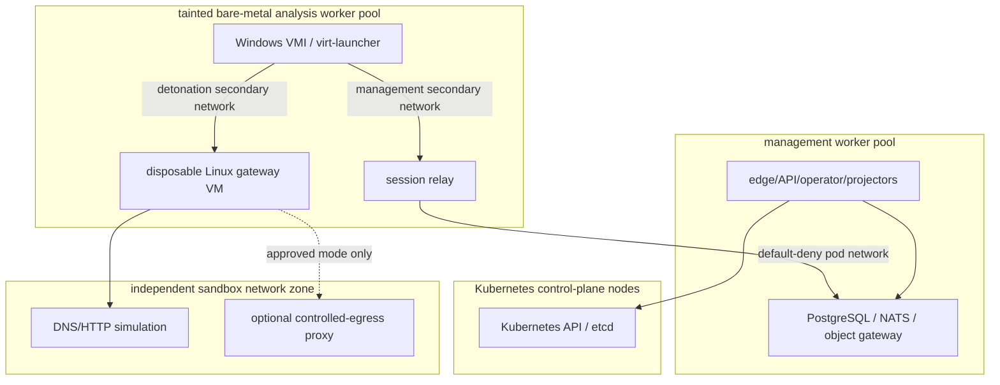
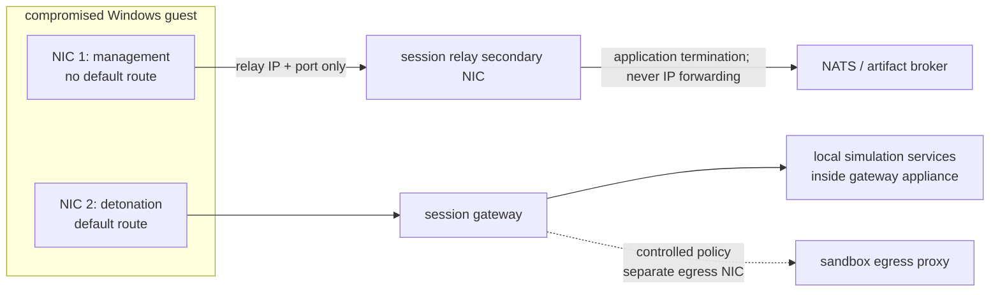

# Kubernetes and KubeVirt Deployment Design

## Deployment profiles

| Profile | Purpose | Security claim |
|---|---|---|
| developer | one-node disposable cluster, one Windows profile, MinIO/PostgreSQL/NATS in cluster | functional lifecycle only; no host or failure-domain isolation claim |
| lab | dedicated multi-node MalZone cluster, local storage/services, offline/simulated networking | controlled internal research with tested network separation |
| production | dedicated control nodes and bare-metal analysis node pool, HA data services, local OIDC/secrets/telemetry | target self-hosted deployment after all isolation/DR gates pass |
| controlled-egress | production plus an independently administered sandbox egress zone | explicit exception; no access to private/metadata/cluster ranges |

The strongest recommendation is a dedicated MalZone Kubernetes cluster on hardware that hosts no
corporate workloads. Namespace, taint, and node-pool separation reduce accidents but do not contain
a hypervisor or node-kernel escape. Analysis workers are treated as a rebuildable security zone.

## Production topology



Control-plane nodes, base-image storage, management workers, and analysis workers use separate
failure domains and network ACLs. Analysis workers can reach only the Kubernetes/node endpoints
required for kubelet/KubeVirt operation, approved image/storage endpoints, DNS/NTP, and telemetry;
these node-level paths are not exposed to guest secondary networks.

## Namespaces and service accounts

| Namespace | Contents | Notes |
|---|---|---|
| `malzone-system` | API, operator, admission, dispatch, event/report services | no sample execution; default-deny network policy |
| `malzone-data` | optional in-cluster PostgreSQL, NATS, object gateway | production may bind external local HA services |
| `malzone-analysis` | VMIs, session relays, gateways, temporary PVCs/NADs | restricted users; controller-managed only; strict quotas |
| `malzone-observability` | Prometheus, collectors, Grafana, alerting | payload-free telemetry; separate admin access |

Each MalZone pod workload has a unique service account. `automountServiceAccountToken: false` is set
at both service-account and pod level unless the component calls Kubernetes. KubeVirt-generated
`virt-launcher` pods are verified to have token automount disabled and the VM specification must not
request a service-account disk or injection sidecar that turns it back on. Only the operator and
console proxy have Kubernetes API credentials, with distinct narrowly scoped roles. The operator
can manage MalZone CRs and named KubeVirt/CDI/CSI/network resources in the analysis namespace; it
cannot read object contents or databases. The console proxy can only access the required VNC
subresource after MalZone authorization.

## Guest network design

The Windows VM and gateway appliance explicitly declare interfaces and do not declare a `pod`
network. They set
`autoattachPodInterface: false` as defense against accidental default attachment. Two Multus
networks are created or allocated for each session:



Requirements for the selected Multus delegate/network provider:

- per-analysis L2/VLAN/VXLAN isolation with no shared broadcast domain between sessions;
- anti-spoofing for MAC/IP, DHCP guard, and no access to host/underlay addresses;
- deterministic cleanup and an inventory API the reaper can query;
- independently enforced ACL/firewall policy for secondary networks; standard Kubernetes
  `NetworkPolicy` alone is not assumed to govern every Multus attachment;
- packet and negative-path testability from inside the guest;
- production support for the chosen KubeVirt interface binding and migration policy.

The management NIC has no default gateway and can reach only the session relay's randomly assigned
link address/port. The relay's secondary interface listens only; kernel IP forwarding is disabled,
it has no `NET_ADMIN`, and routing/NAT binaries are absent from the image. The relay pod's primary
interface is governed by ingress+egress default-deny policy and can reach only NATS, artifact broker,
DNS, and telemetry endpoints required by its protocol.

The detonation NIC's default gateway is a per-analysis hardened Linux KubeVirt appliance VM. That
appliance has no pod network, uses its own one-use identity to send bounded PCAP/flow output to the
relay over the session management network, and has a third sandbox-egress interface only in
`controlled` mode. A platform-owned physical/virtual appliance may provide the same per-session
VRF/VNI contract. A privileged gateway pod is permitted only in the developer profile and cannot be
used as production isolation evidence. Modes are:

| Mode | Behavior |
|---|---|
| `offline` | no default route or all routed traffic rejected; capture still records attempts |
| `simulated` | local deterministic DNS/HTTP/HTTPS/mail and optional fake services; no public route |
| `controlled` | explicit proxy/NAT through a separate sandbox-egress zone; private/reserved/metadata/cluster ranges blocked before and after DNS resolution |

There is deliberately no `unrestricted` mode. Controlled egress enforces destination/port/rate/byte
and duration limits, blocks inbound initiation, prevents forwarding to analyst-supplied VPNs by
default, logs flow decisions, and is disabled if its policy or capture path is unhealthy. TLS
interception is a profile-level opt-in with a guest-only CA and visible report flag; its keys never
leave the session and are deleted at cleanup.

## KubeVirt VM construction

The golden VM is stopped and snapshotted on CSI storage that supports Kubernetes `VolumeSnapshot`
v1. An approved snapshot is immutable by policy and carries a signed MalZone manifest. The operator
creates a `VirtualMachineClone` (or a tested equivalent using a restored `DataVolume`) and waits for
clone readiness before creating/starting the target VM.

Conceptual target fragment:

```yaml
apiVersion: kubevirt.io/v1
kind: VirtualMachine
metadata:
  name: mz-a-01jexample
  namespace: malzone-analysis
  labels:
    malzone.io/analysis-id: 01JEXAMPLEULID
    malzone.io/session-id: 01JSESSIONULID
spec:
  runStrategy: Manual
  template:
    metadata:
      labels:
        malzone.io/analysis-id: 01JEXAMPLEULID
    spec:
      nodeSelector:
        malzone.io/node-role: analysis
      tolerations:
        - key: malzone.io/analysis
          operator: Equal
          value: "true"
          effect: NoSchedule
      domain:
        resources:
          requests: {cpu: "4", memory: 8Gi}
          limits: {cpu: "4", memory: 8Gi}
        devices:
          autoattachPodInterface: false
          autoattachSerialConsole: false
          interfaces:
            - name: management
              bridge: {}
            - name: detonation
              bridge: {}
          disks:
            - name: root
              disk: {bus: virtio}
            - name: session-config
              cdrom: {bus: sata, readonly: true}
      networks:
        - name: management
          multus: {networkName: mz-mgmt-01jexample}
        - name: detonation
          multus: {networkName: mz-red-01jexample}
      volumes:
        - name: root
          dataVolume: {name: mz-root-01jexample}
        - name: session-config
          secret: {secretName: mz-bootstrap-01jexample}
```

This is a design fragment, not a deployable manifest. Exact KubeVirt/CDI fields are generated and
tested against the pinned support matrix, including inspection of the generated `virt-launcher`
pod for token automount and forbidden mounts. The session configuration medium contains only a one-use
bootstrap value and public trust material; it contains no service-account, object-store, NATS,
database, or long-lived private credential.

## Scheduling and resource controls

- Analysis workers are labeled and tainted; admission rejects analysis VMIs elsewhere.
- VM requests equal limits for predictable `Guaranteed` resource treatment where supported.
- Profiles bound vCPU, RAM, root/scratch disk, IOPS, event count, artifact bytes, console duration,
  packets/bytes, and wall-clock time.
- Namespace `ResourceQuota`/`LimitRange`, API project quota, and a scheduler capacity lease all
  apply. Admission reserves capacity atomically before provisioning.
- Concurrency is limited by the scarcest measured resource (RAM, snapshot-clone throughput, IOPS,
  relay/event throughput), not by a hard-coded VM count.
- Anti-affinity spreads management services. Analysis VM distribution is capacity-aware; high-risk
  profiles can request exclusive nodes and trigger node sanitation afterward.
- Live migration is disabled for active malware sessions unless a future provider-specific threat
  model proves the network/capture/storage behavior. Node failure ends the session and cleanup
  reconciles; it does not resume a partially executed sample on a new node.

## Storage classes and data flow

Base snapshots reside on a read-only, operator-protected storage class. Session roots use fast
clone/snapshot-capable storage with deletion reclaim policy and encryption. Analysis PVCs are never
mounted by general management workloads. The guest sees only its cloned root and optional empty
scratch disks—never host paths, shared PVCs, base-image PVCs, samples, or artifact buckets.

The API brokers browser uploads directly into quarantine. The session relay streams the verified
sample from a one-object broker grant and streams artifacts into the analysis prefix. Neither side
gets bucket listing. Object storage is unreachable from guest networks.

## Pod and node hardening

Management/relay workloads run non-root where possible with read-only root filesystems, dropped
capabilities, seccomp `RuntimeDefault`, no privilege escalation, no host namespaces, no hostPath,
and signed digest-pinned images. KubeVirt's required privileged components are installed and
maintained as platform infrastructure; MalZone does not add blanket exemptions.

Analysis nodes enable IOMMU/virtualization protections supported by hardware, current host kernels,
measured/secure boot where operationally supported, audit, runtime detection, and restricted
administrator access. Node firmware, kernel, QEMU/libvirt/KubeVirt, CNI, and CSI patches follow an
accelerated security window. A suspected escape quarantines and rebuilds the node; rescheduling new
work there is prohibited until attested clean.

## Installation order

1. Validate dedicated cluster/node topology, storage snapshot/clone behavior, CNI secondary-network
   isolation, load balancer/ingress, DNS/NTP, and node firewalls.
2. Install pinned Kubernetes add-ons: KubeVirt, CDI, CSI snapshot controller/driver, Multus and the
   selected secondary-network provider.
3. Install local identity, secrets, PostgreSQL, NATS, object storage, and observability or bind to
   environment-owned local services.
4. Apply namespaces, Pod Security admission, quotas, default-deny network policy, admission policy,
   service accounts, and RBAC.
5. Install MalZone management services with no approved golden image yet.
6. Build, verify, sign, import, snapshot, and promote one Windows profile.
7. Run functional canary, then all prohibited-path network tests from a disposable guest.
8. Enable analyst access only after cleanup, artifact, backup, and emergency-stop drills pass.

## Support and compatibility matrix

Each release records and tests exact Kubernetes, KubeVirt, CDI, CSI driver, Multus, network-provider,
storage-provider, Windows build, VirtIO driver, QEMU guest agent, browser, PostgreSQL, NATS, and S3
implementation versions. Upgrade order, skew window, rollback point, and snapshot compatibility are
release artifacts. Alpha/beta upstream APIs such as clone/snapshot features require explicit pinning
and a fallback restore path; the design does not assume API stability from a name alone.

## Upstream design references

- [KubeVirt interfaces and Multus networks](https://kubevirt.io/user-guide/network/interfaces_and_networks/)
- [KubeVirt clone API](https://kubevirt.io/user-guide/storage/clone_api/)
- [KubeVirt snapshot/restore API](https://kubevirt.io/user-guide/storage/snapshot_restore_api/)
- [KubeVirt VNC and console access](https://kubevirt.io/user-guide/user_workloads/accessing_virtual_machines/)
- [Kubernetes NetworkPolicy behavior and limits](https://kubernetes.io/docs/concepts/services-networking/network-policies/)
- [Kubernetes service-account token automounting](https://kubernetes.io/docs/concepts/security/service-accounts/)
