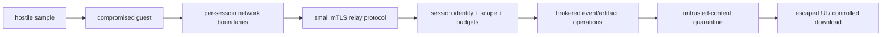
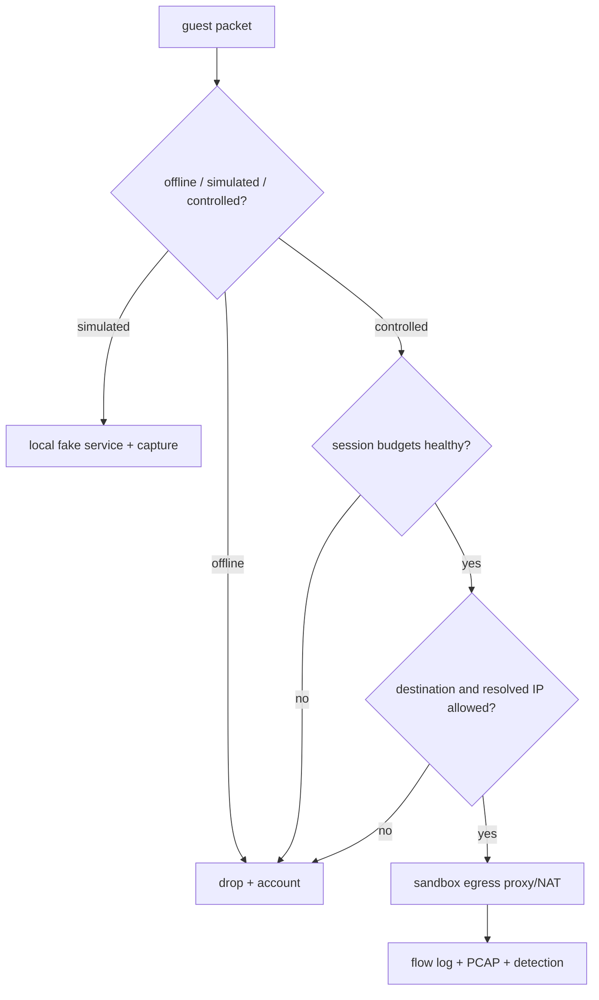

# Threat Model and Zero-Trust Controls

## Security objective

A malicious sample may obtain full Windows administrator/kernel control without gaining a usable
path to the Kubernetes API, cluster/node management, host filesystem, infrastructure credentials,
internal networks, another session, the analyst browser, or unrestricted public targets.

No virtualization platform can promise that a hypervisor escape is impossible. MalZone therefore
combines guest/network isolation with a dedicated cluster or dedicated bare-metal analysis zone,
rapid patching, node quarantine/rebuild, and minimal co-residency. Documentation and UI must say
which deployment profile is active and which isolation properties have actually been tested.

## Assets

- Kubernetes API, etcd, node/kubelet credentials, container runtime, hypervisor, and host kernel;
- management services, signing keys, session CA, OIDC/secrets systems, databases, NATS, object store;
- golden Windows images, build pipeline, VirtIO/agent/tool/rule packages, and promotion records;
- samples, artifacts, reports, analyst identities, project membership, comments, and audit trails;
- private/internal network addresses, public-IP reputation, bandwidth, and third-party systems;
- isolation between concurrent analyses and the integrity/availability of lifecycle cleanup.

## Adversaries and assumptions

| Actor/capability | Assumed |
|---|---|
| submitted sample controls user-mode Windows | yes |
| sample gains Windows admin or kernel execution | yes |
| sample forges agent telemetry, time, filenames, hashes claimed before server verification | yes |
| sample scans/attacks both guest NICs and floods protocols | yes |
| malicious authorized analyst submits pathological content or abuses console/API | yes |
| stolen ordinary analyst token | yes; bounded by project RBAC, expiry, quotas, and audit |
| malicious cluster administrator | not fully contained; mitigate with split duties and external audit |
| KVM/QEMU/kernel/CNI/CSI escape | possible residual risk; dedicated zone and rebuild response required |
| physical/firmware compromise | outside application boundary; environment security prerequisite |

## Trust boundaries

| Boundary | Authentication/authorization | Containment |
|---|---|---|
| user → edge | local/enterprise OIDC, MFA policy, project RBAC, CSRF/origin controls, quota | WAF/rate limit, no internal service exposure |
| edge → internal API | workload TLS identity, exact audience/scope, propagated actor context | explicit NetworkPolicy, bounded deadlines |
| operator → Kubernetes | dedicated short-lived workload identity and resource-scoped RBAC | admission policy, namespace/label restrictions, audit |
| Windows agent → relay | one-use bootstrap then short-lived session mTLS, exact analysis/session binding | secondary network only, schema/size/rate limits, no generic proxy |
| relay → NATS/artifact broker | relay workload identity plus analysis subject/prefix scope | primary-interface default deny, no object listing or cross-session subject |
| guest → gateway | no trust; network placement only | per-session L2, firewall, capture, mode policy |
| gateway → Internet | explicit analysis policy and separate egress zone | deny reserved/internal/metadata, DNS rebinding checks, rate/byte/time caps |
| API/UI → artifact | project permission, disposition policy, optional reauth/reason | attachment download, isolated preview origin, scanner/decompression bounds |

## Threat/control matrix

| Threat | Prevent/detect/recover controls | Required evidence |
|---|---|---|
| guest reaches Kubernetes API/DNS/Services | no pod NIC, no route, secondary-network ACL, node firewall, no token | connect/scan tests from guest to API/DNS/service/node CIDRs fail and are captured |
| cross-analysis traffic | per-session L2/VNI, unique addresses/identities, anti-spoofing | simultaneous A↔B ARP/IP/relay attempts fail |
| relay becomes a router | forwarding disabled, no capabilities, no routing tools, dual-interface egress policy | packet-forwarding and namespace-escape tests fail |
| gateway compromise reaches pod network | production gateway is a no-pod-network appliance VM/external appliance; separate egress and management NICs | gateway → cluster/pod/node paths fail; appliance residue is zero |
| relay protocol exploit | memory-safe implementation, small schema, mTLS, strict parsers, fuzzing, rate/size/deadline limits | fuzz corpus, malformed/replay/flood integration tests |
| object/queue credential theft | guest receives none; relay gets analysis-scoped broker permissions only | secret inventory and attempts to list/read/write other prefixes/subjects fail |
| VM escape/host compromise | dedicated nodes/cluster, patched minimal host, no host devices/folders, monitoring, node quarantine/rebuild | patch SLO, escape canary/alert drill, rebuild runbook |
| SSRF/DNS rebinding through egress | IP classification before/after resolution and redirect, proxy enforcement, block private/reserved/metadata/cluster ranges | literal/encoded IPv4/IPv6, rebinding, redirect, alternative-DNS tests fail |
| attacks on third parties | offline default, controlled allow policy, rate/byte/time caps, inbound deny, abuse kill switch | emergency stop drill and egress policy tests |
| malicious artifact attacks UI/operator | content disposition, safe filename, isolated preview workers/origin, no active rendering, parser sandbox | polyglot/archive bomb/XSS/image/document tests |
| forged/missing telemetry | independent gateway capture, server ingest times, sequence gaps, collector health, signed platform manifest | agent-kill/time-skew/drop/replay tests show degraded report |
| golden image poisoned | offline reproducible build, signed inputs/manifests, split promotion, protected snapshot, canary | manifest verification and unauthorized mutation denial |
| stale clone/shared state | immutable source, unique writable clone and session identity, no pooling after run | pre/post residue and cross-run marker tests |
| cleanup abandonment | finalizer, durable inventory, independent reaper, residue scanner, break-glass audit | crash at every phase then convergence test |
| console hijack/CSRF | one-use user-bound ticket, strict Origin, short expiry, single controller, audit, rate limit | replay/cross-user/cross-project/origin tests |
| control-plane DoS | quotas, admission capacity, separate lifecycle/telemetry resources, backpressure, priority classes | event/artifact flood does not block stop/cleanup |
| dependency/image compromise | pinned hashes/digests, SBOM, signing/provenance, scanning, admission | CI verification and unsigned-image denial |

## Identity and authorization

The self-hosted baseline uses a local OIDC provider; an enterprise IdP is an optional replacement.
Human tokens are accepted only at the edge and are never forwarded into the guest or infrastructure.
Downstream calls use audience-bound workload identities and carry a signed, minimized actor context
for audit. Tenant/project comes from verified membership, never a caller-selected trusted header.

Initial roles are:

- `viewer`: view authorized metadata/reports and safe projections;
- `analyst`: upload, create/stop/interact with analyses, request ordinary downloads;
- `researcher`: request high-risk artifacts/memory and controlled-network profiles;
- `project-admin`: membership, presets, project retention/quota within policy;
- `platform-operator`: capacity/templates/runtime without default sample-content access;
- `security-admin`: profile/egress/rule/retention policy and audited break glass;
- `auditor`: read immutable audit and promotion evidence.

No single routine role can both alter a golden image and promote it, both enable controlled egress
and erase its audit, or both remove an analysis finalizer and suppress the residue alert.

## Session identity and secrets

The production secret authority is local and environment-owned. Static development secrets are
never production defaults. Each analysis receives a distinct bootstrap token and short-lived
certificate. Certificate subject/SAN and application claims bind analysis ID, session ID, relay,
profile, purpose, audience, and expiry. The relay denies a valid certificate at the wrong relay or
for the wrong session. Bootstrap reuse, expired credentials, and clock-skew beyond policy fail closed.

Object, NATS, database, OIDC, signing, and egress credentials are held only by their owning
workloads. Secrets are not present in images, CR specs/status, annotations, environment dumps,
command lines, logs, traces, reports, or support bundles. Rotation supports overlap and revocation;
analysis credentials are revoked before child deletion and again by the reaper.

## Artifact and sample safety

Samples enter a quarantine bucket and are never executed by Linux control-plane workers. Static
analysis uses isolated, non-networked jobs with read-only input, scratch limits, seccomp, no token,
and output schemas. Archive extraction enforces file count, nesting, expanded bytes, compression
ratio, paths, symlink/device rejection, and deadlines.

Artifacts remain `quarantined` until policy assigns another disposition. Malware scanning does not
make an artifact safe. The UI displays only server-normalized metadata and escaped text. Rich
previews run in an isolated origin/worker with no credentials/network and return a rendered derivative,
never active original HTML/SVG/Office/PDF content to the main application origin. Downloads use a
server-generated name, `Content-Disposition: attachment`, `X-Content-Type-Options: nosniff`, strict
CSP where applicable, short grant expiry, and complete audit.

## Interactive controls

Console interaction is high-risk and explicit. The UI shows a persistent “hostile VM” boundary,
active network mode, remaining time, clipboard state, and recording/audit state. Clipboard is
disabled by default; approved text flows only browser → guest, is bounded, normalized, confirmed,
and audited. It never reads guest clipboard. File injection goes through sample quarantine and
hashing. RDP drive/clipboard/printer/USB redirection and direct VNC exposure are prohibited.

Analyst-entered passwords may be recorded in interaction audit or guest capture; the UI warns users
never to enter real credentials or personal data. Test identities and synthetic data are used.

## Network controls

The gateway applies controls in this order:

Blocked ranges include cluster Pod/Service/node/control-plane CIDRs, all organization/private
ranges, loopback, link-local, multicast, carrier-grade NAT, documentation/reserved ranges, IPv4-
mapped/translated IPv6 forms, and cloud metadata endpoints. DNS is gateway-controlled; direct
external DNS, DoH/DoT, QUIC, ICMP tunnels, raw protocols, inbound connections, and port forwarding
are denied unless a separately reviewed profile adds a bounded implementation.

Network capture begins before sample delivery and ends after the guest is stopped. Capture failure
either prevents start or stops a controlled-egress analysis; it cannot silently continue.

## Audit and privacy

Audit events cover authentication, membership/role changes, upload/finalize, analysis creation and
resolved profile, console tickets/connections, every interaction action, stops, network-policy
decisions, artifact access/download, rule/image promotion, retention/deletion, finalizer override,
and break glass. Audit is append-only at the API and exported to an independently administered
local integrity/retention system. Database append-only semantics alone are not immutability.

Logs and metrics never include sample bytes, artifact bytes, command-line content by default,
authorization headers, certificates, object grants, clipboard text, full URLs/query strings, DNS
names, or registry values. Authorized behavioral data belongs in the evidence store under project
retention, not operational logs. Support bundles use allow-listed fields and are scanned before
export.

## Required negative security suite

The production gate executes these from the relevant real source, not only from a CI container:

1. Guest → Kubernetes API, cluster DNS, Pod/Service/node CIDRs, kubelet, storage, databases, NATS,
   object store, observability, IdP, RFC1918, metadata, and another session: denied.
2. Guest management NIC → anything except its relay address/port, and guest detonation NIC → relay:
   denied.
3. Session relay → Kubernetes API, arbitrary internal services, other NATS subjects/object prefixes,
   public Internet, or packet forwarding: denied.
4. Missing/expired/replayed/wrong-session certificate; malformed/oversized/out-of-order event and
   artifact chunks: denied without lifecycle starvation.
5. Wrong project/role, stale version, forged project header, console-ticket replay, hostile Origin,
   ID enumeration, and upload hash/size mismatch: denied and audited.
6. Controlled egress to encoded/resolved/redirected private, IPv6, metadata, DNS tunnel, QUIC, and
   unsupported protocol destinations: denied and visible in capture/decision logs.
7. XSS/polyglot filenames, HTML/SVG/PDF/Office active content, archive bombs, symlinks, path
   traversal, malformed PCAP/image/event text: isolated or rejected without control-plane impact.
8. Operator/relay/agent/worker crash at every lifecycle phase: execution stops and all resources,
   networks, disks, grants, identities, and temporary objects converge to deletion.

## Residual risks and acceptance

Residual risks include novel hypervisor/kernel/firmware escapes, Windows anti-analysis behavior,
telemetry blind spots after agent tampering, storage/CNI implementation flaws, controlled-egress
abuse before detection, and malicious privileged administrators. Production acceptance requires an
owner, severity, mitigation, monitoring signal, response runbook, review date, and explicit risk
sign-off for each open item. “Air-gapped” is only claimed after external route and dependency tests,
including updates, identity, telemetry, fonts/CDNs, license checks, and threat-rule refresh paths.
