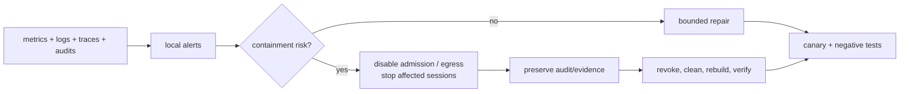

# Day-2 Operations and SRE

## Operating model

MalZone has three operational priorities in order:

1. contain the hostile guest and stop unsafe egress;
2. preserve lifecycle control and destroy analysis resources;
3. retain complete evidence and analyst availability.

Telemetry overload or UI failure must not prevent stop, credential revocation, or cleanup. Control
commands, lifecycle status, event data, and bulk artifacts use separate queues, budgets, and
resource reservations.

## Service objectives

Initial values are design targets and become SLOs only after representative load tests establish a
baseline. Security invariants are not traded against availability error budgets.

| Indicator | Initial target | Exclusions/notes |
|---|---:|---|
| API availability | 99.9% monthly | excludes declared maintenance; authorization denials are success |
| accepted→booted with warm capacity | p95 ≤ 5 min | reported by profile/storage class |
| live event visibility | p95 ≤ 5 sec after relay ingest | guest occurrence time is untrusted |
| stop request→guest stopped | p95 ≤ 15 sec | emergency node isolation is separate |
| terminal trigger→zero session resources | p95 ≤ 5 min, p99 ≤ 15 min | no cleanup is abandoned after target breach |
| event acceptance durability | ≥ 99.99% after relay acknowledgment | explicit gap events count as loss, not success |
| result manifest completeness | 100% terminal analyses | includes declared degraded collectors |
| forbidden-path connectivity | 0 successful probes | any success is a security incident |
| report/export API | p95 metadata query ≤ 2 sec; bounded export tracked asynchronously | artifact size/format reported separately |
| signed webhook delivery | 99.9% accepted events reach success or visible dead letter within policy | upstream endpoint downtime is reported separately |
| promoted image reproducibility | 100% have verified recipe/provenance/validation | no image is selectable without promotion evidence |

## Required telemetry

Every service emits one-object-per-line structured logs with timestamp, level, component, build,
request/trace ID, safe project/analysis opaque IDs, operation, duration, result, and stable error
code. Behavioral payloads and credentials are excluded. W3C trace context propagates through HTTP
and message metadata; async spans link rather than pretend to be one synchronous request.

Metrics include:

- analyses by phase/outcome/profile/network mode and phase duration;
- admission queue depth/age, available capacity, clone/boot latency, Windows handshake time;
- active VMIs/relays/gateways/PVCs/NADs/grants and orphan/residue count;
- reconciliation rate/errors/requeues, finalizer age, cleanup remaining and reaper actions;
- relay sessions, authentication failures, bytes/events, sequence gaps, throttles, rejected frames;
- NATS stream bytes/lag/redeliveries, consumer checkpoint age, dead-letter count;
- object upload/download/error latency, verification failures, bucket/prefix bytes, retention backlog;
- PostgreSQL connections/locks/replication/backup age and outbox age;
- gateway allowed/blocked flows, bytes, destination classes, capture health/drop rate;
- agent/collector health, clock offset, dropped/degraded event counts;
- console sessions/tickets/rejections/idle expiry, without keystroke or clipboard content;
- API request latency/result by safe route template, RBAC/quota denials, and audit-export lag;
- OIDC/JWKS health, login/token failure by safe reason, machine-client scope/quota denials;
- report/export queue age, duration, format/bytes, failures, expiry and download authorization;
- webhook/adapter delivery latency, retries, circuit state, dead-letter age and disclosure-policy denial;
- catalog package/recipe state, compatibility/license blocks, build queue/phase duration, builder
  VM/relay/disk/network residue, validation/promotion/revocation and local mirror capacity.

Cardinality is bounded: raw hashes, filenames, URLs, domains, IPs, PIDs, usernames, and artifact IDs
are evidence fields, not metric labels.

## Critical alerts

| Alert | Immediate action |
|---|---|
| forbidden connectivity probe succeeds | disable new admission, cut sandbox egress, stop affected sessions, preserve evidence |
| analysis reaches terminal with residue | treat as correctness/security incident; reaper and operator page |
| cleanup/finalizer age beyond p99 | revoke identity/egress first, inspect/delete remaining inventory safely |
| capture unhealthy during controlled egress | disable controlled egress and stop affected analysis |
| golden snapshot/signature changes unexpectedly | unapprove profile, stop new clones, investigate supply chain |
| unusual node/hypervisor behavior | cordon/isolate worker, stop sessions, revoke, collect host evidence, rebuild node |
| relay authentication/replay flood | terminate session, revoke certificate, retain flow/evidence |
| queue/object/database capacity critical | stop admission before lifecycle/control capacity is consumed |
| audit export lag/immutability failure | block privileged changes and controlled egress until restored |
| backup or restore drill stale | production-readiness alert, not a low-priority report |
| promoted image provenance/signature/validation missing or revoked | block profile admission and stop affected new starts |
| builder forbidden path or post-build secret residue | quarantine candidate, stop builds, isolate/rebuild builder node |
| SSO or webhook signing/audit integrity failure | fail protected operation closed; pause privileged integrations |

## Runbooks

At minimum, versioned runbooks cover:

- stop one analysis, all analyses on a node, or all admissions;
- immediately disable controlled egress without depending on the MalZone API;
- revoke session, workload, OIDC, object, NATS, signing, or TLS credentials;
- repair an analysis stuck in each phase and safely inspect cleanup inventory;
- quarantine/rebuild an analysis node after suspected escape;
- recover PostgreSQL, NATS, object manifests/artifacts, and audit export;
- rebuild/promote/rollback a Windows golden image and agent/rule bundle;
- respond to malicious artifact parser/UI compromise;
- rotate certificates/keys with overlap and verify old-key revocation;
- handle object-store exhaustion, event storm, clone/storage failure, and CNI leak;
- perform legal hold, project deletion, and verified data erasure;
- generate a sanitized support bundle without samples or behavior payloads;
- import/review/build/promote/revoke a software version or image, quarantine a builder node, and
  clean an interrupted build;
- recover local OIDC, rotate machine/webhook identities, replay dead-letter deliveries, and rebuild
  an export without changing its source report version.

Every destructive or break-glass command first resolves exact analysis/session/resource labels and
records an audit reason. Broad namespace deletion is not a normal cleanup mechanism.

## Backup and restore

| Data | Protection | Restore acceptance |
|---|---|---|
| PostgreSQL | encrypted base backup + WAL/PITR to independent local storage | restore to isolated environment, reconcile outbox/projections, meet measured RPO/RTO |
| object storage | versioning/replication or backup according to retention, manifests protected with object lock where required | verify object/version count and hashes against signed manifests |
| NATS | replicated file-backed stream and configuration backup; raw event chunks remain in object storage | restore consumers/checkpoints; replay without duplicate projections |
| golden images | signed source/build manifests plus protected snapshot/export in separate failure domain | import, verify signature/hash, boot canary, pass isolation suite |
| configuration/policy | signed Git release/GitOps source and secret-manager backup | recreate clean cluster without copying runtime credentials |
| audit | continuous export to independently administered append-only local store | query actor/action timeline and verify integrity chain |
| catalog/recipes/provenance | signed versioned repository plus immutable mirrored artifacts and protected promotion records | rebuild candidate from exact inputs and compare inventory/validation |
| IdP/integration configuration | local IdP/config backup; connector secrets in secret authority; delivery checkpoints backed up | restore login/machine scopes and replay without duplicate side effects |

Backups never include live session private keys. Restore into production does not automatically
resume incomplete detonations: non-terminal analyses are stopped, evidence is marked interrupted,
and cleanup is reconciled. RPO/RTO are set after business classification; until drills prove them,
they are recorded as unknown rather than guessed.

## Upgrade and rollback

Upgrade order follows the tested compatibility matrix: data backups and restore proof, infrastructure
operators/CRDs within supported skew, data migrations, stateless management services, operator,
relays/gateways, then new golden image/agent profiles. Existing analyses keep their resolved
versions and are allowed to finish only when mixed-version conformance is tested; otherwise
admission drains before upgrade.

Database migrations are expand/contract and backward compatible across the rollback window. CRD
conversion/storage versions are tested before removing an old served version. Event consumers
accept at least the previous schema minor version. Golden images and rule bundles are immutable;
rollback selects the previous approved version instead of mutating a snapshot.

Release canaries must complete an offline and simulated analysis, produce the expected manifest,
pass residue scanning, and execute the complete negative connectivity suite. Controlled egress is
enabled last.

## Capacity and admission

Capacity models include analysis and builder VM RAM/vCPU, root clone IOPS/throughput, boot storms,
image-build duration/cache/mirror/candidate/promoted snapshot storage, Windows/application licensing,
network capture throughput/storage, relay CPU/memory, events/sec, NATS retention, projector lag,
object bytes, database write/index load, report/export workers, webhook/adapter backlog, and local
OIDC/observability capacity. Per-profile benchmark
results feed an admission controller. Queues have maximum age; users receive a clear queued,
capacity-rejected, or quota-rejected state.

Reserve headroom for stop/cleanup, node loss, compaction, and backup. Admission halts before data or
control systems exhaust disk. High-volume PCAP and memory profiles have independent quotas so they
cannot starve ordinary analysis.

## Routine checks

- continuous: health, forbidden canary connections, residue count, credential/audit/capture health;
- daily: backup success, finalizer/reaper backlog, capacity forecast, signature/certificate expiry;
- weekly: restore sample, one full canary analysis, dependency/rule/image vulnerability review;
- monthly: negative isolation matrix, emergency stop/egress cut, project RBAC review, node rebuild;
- per release: full compatibility, upgrade/rollback, load, fault injection, cleanup crash matrix;
- quarterly: full DR exercise, threat-model/risk review, access/split-duty review, retention proof.
