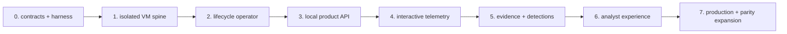

# Delivery Roadmap and Acceptance Gates

## Delivery rule

Security is not a final hardening phase. Each phase ships its own identity, authorization, network
policy, cleanup, observability, and negative tests. A capability stays `designed` in the conformance
map until working code, packaging, and automated evidence exist.

## Phase 0 — contracts and test harness

Deliver:

- repository/tooling skeleton and generated Go/TypeScript contract workflow;
- `Analysis` CRD types/state transition library, public OpenAPI baseline, event envelope/schemas;
- software-package/image-recipe, profile, artifact manifest, export/webhook, error, audit, and
  compatibility contracts;
- local CI with unit, schema compatibility, documentation, lint, SBOM, and secret checks;
- explicit dependency/version support matrix and development threat model.

Gate: invalid state transitions/schemas fail tests; every planned runtime edge and owner appears in
conformance; no service code is added without a contract and data owner.

## Phase 1 — isolated disposable VM spine

Deliver:

- documented local Kubernetes/KubeVirt/CDI/CSI/Multus prerequisites;
- reproducible one-profile Windows image pipeline from exact local package manifests and signed
  snapshot/provenance manifest;
- isolated builder VM/relay on a separate build network with local installer mirror and cleanup;
- manual clone/start/VNC/stop/delete flow;
- two guest secondary networks, no guest pod network, offline and simulated gateways;
- session relay skeleton and one-use bootstrap handshake;
- manual residue scanner and exact cleanup inventory.

Gate: from inside Windows, every cluster/node/private/other-session path is denied; a canary sample
boots, is visible through proxied VNC, and leaves no PVC/NAD/secret/identity/relay/gateway/VM residue.
From the builder, cluster/data/analysis/corporate/Internet paths are also denied and failed builds
leave no resources or license secrets. A one-node developer result does not satisfy the production-
isolation gate.

## Phase 2 — lifecycle operator

Deliver:

- `Analysis` CRD/admission, controller-runtime reconciler, deterministic child resources;
- clone, relay, gateway, VM boot/handshake, run deadline, collect, destroy, finalizer, reaper;
- cancellation, timeout, capacity reservation, conditions, events, metrics, and audit;
- envtest/unit tests plus cluster fault injection at every phase.

Gate: repeated reconcile/messages are safe; operator/node/component restarts converge; all outcomes
pass through cleanup; final state is withheld until residue is zero; break-glass is audited.

## Phase 3 — fully local product API and storage

Deliver:

- self-hosted OIDC, scoped machine clients, project RBAC, API gateway and committed analysis API;
- PostgreSQL migrations/transactional outbox, NATS, S3-compatible quarantine/artifact service;
- streamed upload/finalize/hash verification, immutable profile resolution, list/get/stop APIs;
- workload/session identities, object/subject scoping, audit export;
- catalog/recipe API with curated and project-private visibility, exact resolution and build status;
- backup/restore and resource-quota baseline.

Gate: cross-project/role/idempotency/upload mismatch negatives pass; database/broker/object restart
does not duplicate execution or lose cleanup; restored state can reconcile safely.

## Phase 4 — interactive telemetry

Deliver:

- signed Windows service, launcher, heartbeat, process/file/registry/network/DNS/event-log collectors;
- versioned relay protocol, event writer/chunks/projections, collector health and sequence gaps;
- screenshots and KubeVirt VNC console proxy with keyboard/pointer and gated clipboard;
- live WebSocket with resumable cursor; UI shell with synchronized desktop/process/timeline/network.

Gate: analyst interaction works without direct VMI/Kubernetes exposure; kill/tamper/flood the agent
and the report shows degradation; relay fuzz/load tests do not starve stop/cleanup.

## Phase 5 — evidence, detections, and local reports

Deliver:

- PCAP/flow capture, safe dropped-file/log/screenshot collection, signed result manifest;
- local YARA and Suricata workers, deterministic behavior rules, pinned ATT&CK mapping;
- process tree/graph, IOC extraction with provenance, artifact browser and controlled downloads;
- deterministic JSON report and isolated human-readable rendering;
- asynchronous report/IOC/evidence export API with hashes, redaction, expiry and controlled download;
- retention/legal hold/deletion workflow.

Gate: artifact hashes and event chunk chain verify; parser/archive/XSS/polyglot tests are contained;
rules/report are reproducible from stored evidence; deletion and backup retention behave as policy.

## Phase 6 — analyst-grade interactive experience

Deliver:

- profile presets, client-selected immutable software/image recipes, locale/start-action controls,
  licensing/review visibility and clear network/privacy controls;
- detailed per-process event view, HTTP/TLS/DNS/Suricata views, PCAP inspection/export;
- tags, comments, verdict, comparison, search, collaboration policy, keyboard accessibility;
- transparent local automated-interaction playbooks with action trail;
- signed metadata webhooks, JSON/STIX/MISP exports, and optional local SIEM/SOAR/TIP adapters with
  connector-owned credentials, retries/dead letter and disclosure policy.

Gate: end-to-end SOC usability tests complete representative file, document, archive-password, URL,
and phishing workflows; all actions are auditable; optional adapters disclose no data when disabled.

## Phase 7 — production readiness and parity expansion

Deliver:

- HA management/data services, external local secret authority, immutable audit, GitOps, DR;
- dedicated-node/cluster hardening, node quarantine/rebuild automation, full compatibility matrix;
- controlled-egress zone with emergency kill switch and abuse monitoring;
- performance/capacity tuning, SLO dashboards, upgrade/rollback automation;
- optional memory collection, richer static analysis/debugger, config extraction, local model-assisted
  summaries, additional Windows profiles, and later Linux/macOS/Android only through new designs.

Gate: independent security assessment, full forbidden-path suite, load/fault/upgrade/rollback/restore
drills, signed risk acceptance, and operations handover. Feature breadth never overrides the core
isolation and cleanup gates.

## Capability target by milestone

| Capability | P1 | P3 | P4 | P5 | P6/P7 |
|---|---:|---:|---:|---:|---:|
| fresh Windows detonation | manual | API-controlled | automated | hardened | multiple profiles |
| local/air-gapped operation | basic | complete dependencies | complete | complete | DR/multi-cell |
| browser interactivity | VNC canary | authorized proxy | live synchronized UI | evidence-linked | collaboration/playbooks |
| behavior | boot/heartbeat | status | core live collectors | detections/IOC/graph | advanced/memory/static |
| networking | offline/simulated | policy/API | live flows/DNS | PCAP/Suricata | controlled egress/MITM options |
| reporting | cleanup proof | metadata | raw event history | deterministic full report | exports/integrations |
| custom OS software | exact manifest/profile canary | catalog/build API | promoted image selection | provenance linked | client recipes and lifecycle |
| SSO/API/workflows | contract skeleton | local OIDC + machine API | live resumable API | report/export API | signed webhooks/adapters |

## Definition of done for every phase

- design, conformance map, contracts, implementation, deployment, and operations agree;
- unit, contract, integration, negative security, cleanup, and upgrade tests are proportional to risk;
- images/dependencies are pinned and scanned; SBOM/provenance is generated;
- configuration and secrets are documented with safe defaults and no hard-coded environment values;
- dashboards, alerts, backup/restore, failure modes, and runbooks exist for shipped state;
- mocks/development issuers/single-node limitations are visibly marked non-production;
- known gaps have an owner and are not presented as working functionality.
- material design impact and known gaps are summarized, and CI governance/conformance checks pass.
