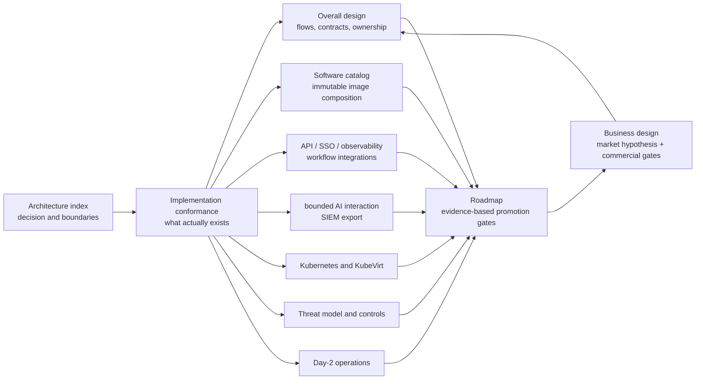

# MalZone High-Level Design

MalZone is **enterprise-controlled malware-analysis infrastructure** for organisations that need to
investigate hostile Windows files without giving a public cloud control of their samples, evidence,
identity, or operations. It combines the live, interactive experience expected from a modern
malware sandbox with local and air-gapped deployment, customer-specific Windows software images,
API-first workflow integration, defensible evidence, and deterministic destruction of every
analysis environment.

The product is intended for government, defence, national CERT, critical-infrastructure,
financial-services, healthcare, DFIR, security-vendor, and large MSSP teams whose privacy,
sovereignty, audit, integration, or representative-environment requirements are not adequately met
by a public analysis service. Its value is not Kubernetes or self-hosting by itself: MalZone must
make sensitive analysis safer, reproducible, automatable, and supportable inside infrastructure the
customer controls.

This design set explains how that business promise becomes an enforceable product architecture.
Begin with the [architecture index](design_01.md), review the
[business value and market strategy](../business/business-value-and-market-strategy.md), and use the
[implementation-conformance map](00-implementation-conformance.md) before treating any target-state
capability as shipped functionality.

## Design set

1. [Architecture index](design_01.md)
2. [Implementation conformance](00-implementation-conformance.md)
3. [Objectives and principles](10-overall/01-objectives-principles.md)
4. [Runtime topology and analysis lifecycle](10-overall/02-runtime-topology-lifecycle.md)
5. [Contracts, APIs, and data ownership](10-overall/03-contracts-data.md)
6. [Components and technology decisions](10-overall/04-components-technology.md)
7. [Software catalog and Windows image composition](10-overall/05-software-catalog-image-composition.md)
8. [API, identity, observability, and workflow integrations](10-overall/06-api-identity-observability-integrations.md)
9. [AI automation and SIEM export](10-overall/07-ai-automation-siem.md)
10. [Kubernetes and KubeVirt deployment](20-deployment/01-kubernetes-kubevirt.md)
11. [Threat model and zero-trust controls](30-security/01-threat-model-zero-trust.md)
12. [Day-2 operations and SRE](40-operations/01-day2-sre.md)
13. [Delivery roadmap and acceptance gates](50-roadmap/01-delivery-roadmap.md)
14. [Architecture decision log](../decisions/README.md)
15. [Repository design-sync governance](../../prompts/governance/README.md)
16. [Business value and market strategy](../business/business-value-and-market-strategy.md)
17. [GitHub Pages documentation portal](../../index.md)

## Reading rules

- Solid arrows in a diagram describe the target architecture unless the diagram explicitly says
  they are implemented. The conformance map is the only implementation-truth document.
- A design control is not evidence. Security claims require a positive test and, where applicable,
  a negative connectivity or authorization test in a real cluster.
- Kubernetes is the production packaging target. A single-node developer cluster can prove API and
  lifecycle behavior, but cannot prove host, network, or failure-domain isolation.
- The Windows guest and all guest output are hostile. Nothing received from an analysis VM is
  trusted because it is signed, well-formed, or produced by the MalZone agent.
