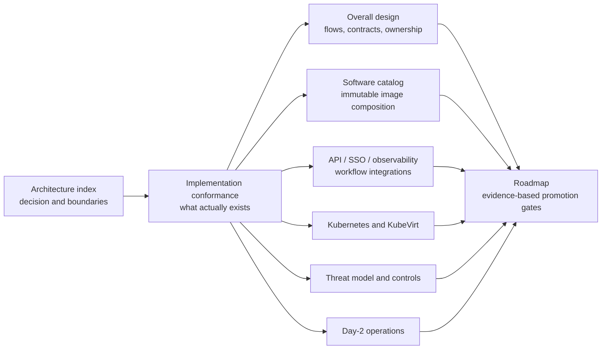

# MalZone High-Level Design

This directory is the canonical architecture set for MalZone. Start with the architecture index,
then read the implementation-conformance map before treating a target-state requirement as shipped
functionality.

## Design set

1. [Architecture index](design_01.md)
2. [Implementation conformance](00-implementation-conformance.md)
3. [Objectives and principles](10-overall/01-objectives-principles.md)
4. [Runtime topology and analysis lifecycle](10-overall/02-runtime-topology-lifecycle.md)
5. [Contracts, APIs, and data ownership](10-overall/03-contracts-data.md)
6. [Components and technology decisions](10-overall/04-components-technology.md)
7. [Software catalog and Windows image composition](10-overall/05-software-catalog-image-composition.md)
8. [API, identity, observability, and workflow integrations](10-overall/06-api-identity-observability-integrations.md)
9. [Kubernetes and KubeVirt deployment](20-deployment/01-kubernetes-kubevirt.md)
10. [Threat model and zero-trust controls](30-security/01-threat-model-zero-trust.md)
11. [Day-2 operations and SRE](40-operations/01-day2-sre.md)
12. [Delivery roadmap and acceptance gates](50-roadmap/01-delivery-roadmap.md)
13. [Architecture decision log](../decisions/README.md)
14. [Repository design-sync governance](../../prompts/governance/README.md)

## Reading rules

- Solid arrows in a diagram describe the target architecture unless the diagram explicitly says
  they are implemented. The conformance map is the only implementation-truth document.
- A design control is not evidence. Security claims require a positive test and, where applicable,
  a negative connectivity or authorization test in a real cluster.
- Kubernetes is the production packaging target. A single-node developer cluster can prove API and
  lifecycle behavior, but cannot prove host, network, or failure-domain isolation.
- The Windows guest and all guest output are hostile. Nothing received from an analysis VM is
  trusted because it is signed, well-formed, or produced by the MalZone agent.
