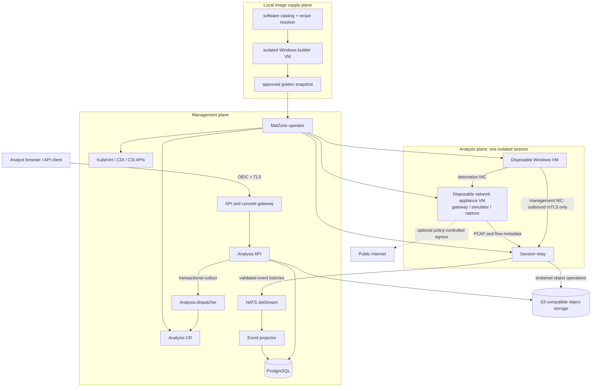
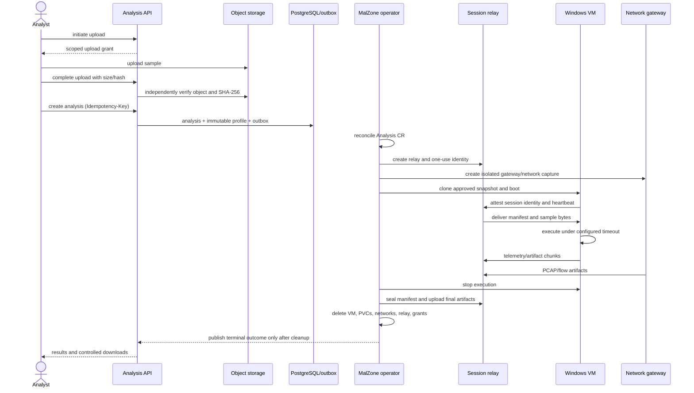

# MalZone Architecture Index

## Decision

MalZone is enterprise-controlled malware-analysis infrastructure: a self-hosted, Kubernetes-native,
ANY.RUN-style interactive malware-analysis platform. Every required runtime dependency can operate
locally and air-gapped; no MalZone control, sample, telemetry, identity, or evidence service depends
on a vendor cloud. It uses KubeVirt to run a fresh Windows clone for every analysis, places that
guest on analysis-specific networks, mediates all communication through narrow relays, records
behavior and artifacts, and destroys every analysis environment after collection.

The control plane coordinates work. It does not execute samples. The analysis plane assumes the
guest is fully compromised. The data plane stores quarantined inputs and untrusted outputs behind
service APIs. These planes may share a development cluster, but the production design uses a
dedicated cluster or, at minimum, dedicated analysis nodes with independent network and storage
controls.

The initial product is a defensive research sandbox, not a public detonation service, an endpoint
evasion product, or a mechanism for delivering malware to third parties.

“ANY.RUN-style” means the analyst experience—live desktop interaction, a live process tree and
timeline, per-process behavior, network/DNS/HTTP views, detections, artifacts, and exportable
reports—not a dependency on ANY.RUN or an attempt to reproduce its proprietary implementation.

The corresponding commercial position is enterprise-controlled malware-analysis infrastructure
for organisations that require local or air-gapped operation, data sovereignty, customer-specific
Windows software images, API-led workflow integration, evidence provenance, and supported
lifecycle management. MalZone does not assume that being self-hosted or Kubernetes-based is itself
a durable advantage; the product must prove that it solves control and operational requirements
better than cloud, private-cloud, commercial on-premises, and open-source alternatives. The market
hypothesis, packaging principles, competitive boundaries, first sellable scope, risks, and paid
validation gates are maintained in the
[business value and market strategy](../business/business-value-and-market-strategy.md).

## System boundaries

| Plane | Owns | Must not own or expose |
|---|---|---|
| Edge | OIDC login, RBAC, upload initiation, REST/WebSocket/console entry points | Kubernetes credentials, object-store credentials, VM lifecycle logic |
| Control | admission, scheduling, `Analysis` reconciliation, timeouts, cleanup, status projection | sample execution, raw artifact parsing in privileged processes |
| Analysis | disposable Windows VM, per-analysis relay, network gateway/simulator, capture | reusable credentials, cluster service discovery, host paths, cross-analysis networks |
| Data | PostgreSQL metadata, NATS streams, S3-compatible quarantine/artifact buckets | direct guest access, cross-service table access, executable content rendering |
| Image supply | package catalog/mirror, isolated builder VMs, validation, immutable golden-image promotion | analysis samples, mutable Internet installers, reusable license/build secrets in images |
| Integration | versioned API, report/export jobs, webhook dispatch, provider adapters | direct database/NATS/S3/Kubernetes/VM access or vendor credentials in core services |
| Operations | identity, secrets, policy, audit, monitoring, image/template promotion | analyst workflow state or malware payloads in logs |

## Non-negotiable invariants

1. Every analysis starts from an immutable, approved golden-image version and gets new writable
   disks, identities, network segments, and credentials.
2. A VM or writable disk that has executed a sample is never returned to the clean-image pool.
3. The guest has no Kubernetes pod-network interface, service-account token, host mount, node
   credential, or route to the Kubernetes API, node management addresses, or internal networks.
4. The only guest management path is outbound, mutually authenticated, analysis-scoped traffic to
   its relay. The relay never routes packets between its guest and pod interfaces.
5. Internet access is off by default and can only be enabled through an analysis gateway that
   blocks private, link-local, metadata, management, and cluster address ranges.
6. Large samples, raw telemetry, PCAPs, dumps, and dropped files live in object storage. PostgreSQL
   stores metadata and query projections, not bulk binaries.
7. Every lifecycle operation is idempotent. Cancellation, timeout, or failure changes the desired
   outcome but never skips artifact finalization and cleanup.
8. An analysis is not terminal while analysis-scoped compute, writable disks, networks,
   credentials, or upload grants still exist.
9. UI rendering, previewing, downloading, and exporting artifacts treat filenames, MIME types,
   archives, HTML, scripts, images, documents, and event text as hostile.
10. Capability claims are promoted only with repository and cluster evidence recorded in the
    [conformance map](00-implementation-conformance.md).

## Target topology

The relay is dual-attached but is not a router: its secondary interface terminates a small,
authenticated application protocol and its primary interface can reach only explicitly required
management services. It has no service-account token, no forwarding capability, no privileged
security context, no shared object-store credential, and is deleted with the session.

## Primary analysis flow

## Key decisions

| Decision | Rationale | Consequence |
|---|---|---|
| KubeVirt with disposable snapshot clones | Stronger guest isolation and Windows compatibility than containers | Requires hardware virtualization, CSI snapshots, dedicated capacity, and KubeVirt operations expertise |
| No pod network in the Windows guest | Removes the direct path to cluster DNS, Services, API, and node-local endpoints | Requires Multus/secondary network engineering and a session relay |
| Per-analysis relay and network segments | Bounds identity, reachability, rate, and blast radius | More objects per run and cleanup complexity |
| Gateway is an appliance VM, not a privileged pod bridge | Keeps elevated packet/NAT logic off the cluster pod network | Adds one small VM and image lifecycle per session |
| PostgreSQL + outbox is product-state authority; CR status is runtime authority | Avoids split-brain while preserving Kubernetes reconciliation | Requires explicit projection and repair logic |
| NATS JetStream transports events, not authoritative lifecycle state | Supports fan-out, replay, and backpressure without making the broker the source of truth | Consumers must be idempotent and tolerate duplicates |
| S3-compatible object storage for all bulk content | Scales PCAP/dumps and supports retention/immutability controls | Every download and preview needs quarantine policy |
| Go for API/operator/relay/agent; TypeScript for UI | Shared contracts, strong Kubernetes ecosystem, simple static Windows agent | Windows collector work still requires native API expertise |
| Internet modes are `offline`, `simulated`, and `controlled` | Makes risk explicit and defaults safe | “Unrestricted Internet” is intentionally unsupported |
| Exact software manifests build immutable images | Reproducible client-selected OS software without Internet/runtime installation | Requires catalog, mirror, hostile builder zone, licensing and promotion workflow |
| UI and integrations share versioned APIs | Preserves API-first automation and prevents privileged UI-only behavior | Requires OpenAPI compatibility, machine identity, exports, webhooks and adapter conformance |
| AI proposes closed-schema actions; deterministic policy executes them | Enables local agent automation without giving a probabilistic model a shell, console, infrastructure credential, or containment authority | Requires evidence cursors, action budgets, controller leases, approvals, hostile prompt-input tests and immutable action audit |
| Canonical events feed credential-isolated SIEM adapters | Supports ECS/OCSF/STIX and customer systems without coupling core services or disclosing hostile content by default | Requires disclosure policy, deterministic event IDs, checkpoint/retry/dead-letter semantics and adapter-specific conformance |
| Publish design as a static GitHub Pages artifact | Makes architecture, business intent and honest conformance easy to review | Public workflow must be opt-in and exclude secrets, malware, customer data and deployment-private supplements |

## Design governance and implementation synchronization

MalZone treats architecture as an enforceable repository contract, not a one-time design document.
Human and AI-assisted changes must classify their impact, update design and machine-readable
contracts together with code, provide executable evidence, and report any remaining production
gaps. A change is not complete when implementation, conformance, security, deployment, operations,
tests, and documentation disagree.

```mermaid
flowchart LR
    Request["requested change"] --> Rules["repository rules"]
    Rules --> Classify["minor / major classification"]
    Classify --> Impact["architecture + trust + ownership impact"]
    Impact --> Sync["design + contracts + implementation"]
    Sync --> Evidence["tests + negative security evidence"]
    Evidence --> Gate["changed-file CI design-sync gate"]
    Gate --> Conformance["honest implementation-conformance status"]
```

### Canonical governance assets

| Asset | Purpose | Enforcement |
|---|---|---|
| [Canonical repository rules](../../../CLAUDE.md) | mandatory architecture, security, validation, documentation and completion rules for every human or AI-assisted change | requires change classification, synchronized design/contracts/tests and automatic changed-file enforcement |
| [Agent discovery rules](../../../AGENTS.md) | makes the canonical repository policy automatically discoverable to coding agents | directs every agent to `CLAUDE.md` and prohibits modifications to the reference `aiops-fabric` repository |
| [Human contribution rules](../../../CONTRIBUTING.md) | concise contributor workflow for implementation and review | blocks unsupported maturity/security claims and points contributors to executable validation |
| [Repository governance pack](../../prompts/governance/README.md) | major-change policy, reusable guardrail, reviewer checklist and change-record template | defines what must change together and when a change is not merge-ready |
| [Major-change policy](../../prompts/governance/major-change-policy.md) | classifies service, contract, trust, networking, VM, data, deployment and operational changes | uncertainty is classified as major; major changes require conformance and affected design updates |
| [Implementation conformance](00-implementation-conformance.md) | authoritative map of implemented, configuration-ready, designed and not-started capabilities | must change with every route, event, runtime edge, state owner, trust boundary, maturity or evidence change |
| [Architecture decision records](../decisions/README.md) | preserves durable decisions and consequences instead of silently rewriting architecture history | significant decisions are added or superseded explicitly |
| [Machine-readable contracts](../../../contracts/README.md) | versioned OpenAPI, CRD, event, profile, artifact, software and image boundaries | schemas/examples are validated and must agree with prose and runtime behavior |
| [Pull-request template](../../../.github/pull_request_template.md) | prompts a concise summary, design impact and reviewer checklist without a fixed report schema | reviewers retain context without making PR-body formatting a merge dependency |
| [Design-sync CI workflow](../../../.github/workflows/design-sync.yml) | runs governance, documentation, conformance, contract and changed-file checks on pushes and pull requests | implementation-sensitive PRs must update the conformance map and an affected high-level design or ADR |
| [PR design-sync checker](../../../scripts/check_design_sync.py) | derives synchronization requirements from the actual changed files | fails CI for unsynchronized implementation, deployment, guest, operator, service or contract changes; it does not parse PR text |
| [Automated alignment tests](../../../tests/test_design_alignment.py) | validates canonical documents, links, Mermaid blocks, maturity claims and implemented route coverage | `make design-check` is mandatory for every change |

### Mandatory change workflow

1. Read the repository rules and classify the change using the major-change policy. If uncertain,
   classify it as `major`.
2. Read this architecture index, the implementation-conformance map, affected domain design, ADRs,
   and machine-readable contracts before implementation.
3. Identify changes to APIs/events, runtime edges, state/data owners, trust boundaries, privileges,
   credentials, Kubernetes/KubeVirt resources, cleanup obligations, SLOs and failure modes.
4. Update design, contracts, implementation, deployment, security controls, operations and tests in
   the same change set.
5. Prove positive behavior and relevant authorization, isolation, hostile-content, fault and cleanup
   denial behavior. Rendered manifests alone do not prove enforcement.
6. Run `make design-check` and every implementation-specific validation target.
7. Summarize material design impact, validation evidence, and known gaps for review. Ensure the
   automatic changed-file design-sync gate passes before merge.

### Automated enforcement

The gate does not inspect the pull-request description and has no mandatory report-field format.
It examines the diff against the PR base. A change under an implementation-sensitive path such as
`api/`, `controller/`, `contracts/`, `deploy/`, `guest/`, `operator/`, or `services/` must include:

1. an update to `docs/design/high-level/00-implementation-conformance.md`; and
2. an affected high-level design document or non-index ADR.

Normal review communication still records meaningful architecture, trust, evidence, and gap
information, but wording or formatting that communication cannot make CI fail.

This governance layer is itself part of the architecture. Removing, bypassing or weakening it is a
major change and requires an explicit replacement with equivalent enforcement.

## Design scope and non-goals

The first production-worthy release supports PE/script/document detonation in one approved Windows
profile, live status and telemetry, process/network/file/registry views, PCAP and artifact download,
manual stop, bounded console access, and deterministic cleanup.

Initial non-goals are bare-metal malware, macOS/Linux guests, kernel debugging, automatic malware
family attribution, public anonymous submissions, multi-region active/active operation, stealth
evasion features, direct RDP exposure, AI-accessible shells or arbitrary generated tools, arbitrary
packet forwarding, and automatic release of dropped files from quarantine.
