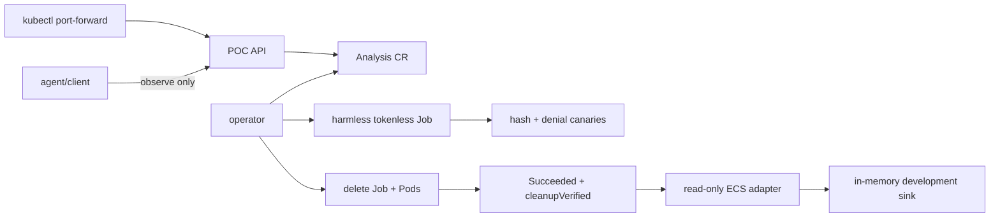

# Harmless Kubernetes Lifecycle POC

This POC proves a small API → custom resource → operator → disposable runner → collection → cleanup
loop on the local k3d cluster. It also proves an observe-only agent action and metadata-only ECS
lifecycle export into a development sink. It does **not** run malware, Windows, KubeVirt, arbitrary
commands, desktop input, URLs, uploaded files, or caller-selected images.

## Prerequisites

- Go 1.24 or later;
- Docker and k3d cluster `cks`;
- `kubectl` current context `k3d-cks`;
- Helm 3 or 4;
- ARM64 by default; set `TARGETARCH=amd64` for an x86_64 cluster.

## Deploy and test

```bash
make check
make deploy-poc
make e2e-poc
```

Deployment creates or reuses only `malzone-system`, labels it with restricted Pod Security,
installs the CRD, and installs the `malzone` Helm release. The API remains a ClusterIP service.



Inspect without exposing the service:

```bash
kubectl -n malzone-system get deploy,pods,service,networkpolicy
kubectl -n malzone-system get analyses
kubectl -n malzone-system logs deployment/malzone-operator
kubectl -n malzone-system logs deployment/malzone-siem-adapter
```

For a manual API call, start `kubectl -n malzone-system port-forward service/malzone-api 18080:8080`
and POST the bounded canary contract shown in `scripts/poc_e2e.sh`.

The same E2E script waits for `Running`, proves that `type=shell` is rejected, submits one
`type=observe` request, and checks the operator's observation result. This is control-plane plumbing,
not screen observation: the POC has no Windows guest, console relay, screenshot, or behavior
collector.

`malzone-siem-adapter` has only `get/list` access to POC `Analysis` resources. It emits one
deterministic ECS-shaped lifecycle event after terminal cleanup is verified. The tokenless
`malzone-siem-sink` keeps at most 100 events in memory and is available only as a ClusterIP. The E2E
test verifies that canary content, action rationale, result summary, and observation detail are not
exported. The sink has no authentication, persistence, TLS, durable checkpoint, retry queue,
disclosure engine, or production SIEM compatibility and must never be exposed.

## Windows decision

The observed cluster is ARM64 k3d and has no KubeVirt, CDI, Multus, or snapshot support. A Windows
11 Enterprise Arm64 evaluation ISO exists, but media registration/licensing, VirtIO support, image
import, snapshot storage, secondary networking, and acceptable virtualization performance still
need a dedicated environment. The recommended next Windows target is a dedicated x86_64 Linux
worker with hardware virtualization, KubeVirt/CDI, Multus, snapshot-capable CSI storage, and a
customer-supplied licensed Windows 11 Enterprise ISO. Do not treat software emulation on this k3d
cluster as production evidence.

The non-runnable [Windows starter skeleton](../../examples/windows/README.md) records the proposed
x86_64 VM shape, two Multus networks, no pod interface, and per-analysis writable clone placeholder.

Official references:

- [Microsoft Windows 11 Enterprise Evaluation](https://www.microsoft.com/en-us/evalcenter/evaluate-windows-11-enterprise)
- [KubeVirt installation and virtualization requirements](https://kubevirt.io/user-guide/cluster_admin/installation/)
- [KubeVirt Windows VirtIO driver guidance](https://kubevirt.io/user-guide/user_workloads/windows_virtio_drivers/)

## Remove the POC

The release is isolated to `malzone-system`. Removal is intentionally manual so an operator can
inspect CRs and residue first:

```bash
kubectl -n malzone-system get analyses,jobs,pods
helm uninstall malzone --namespace malzone-system
```

The cluster-scoped CRD and namespace are not deleted automatically.
