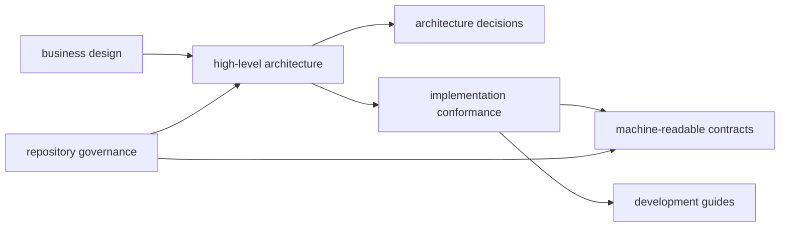

# MalZone Documentation

MalZone is enterprise-controlled malware-analysis infrastructure: a self-hosted, API-first platform
for safely submitting, observing, interacting with, reporting on, and destroying disposable Windows
analysis environments. The target experience is interactive and automation-friendly while samples,
evidence, identity, infrastructure, and operating policy remain under the customer's control.

> MalZone is under active development. Target architecture is not shipped functionality. Always
> check the [implementation-conformance map](design/high-level/00-implementation-conformance.md)
> before relying on a capability.

## Start here

- [What MalZone is and its current status](../README.md)
- [High-level design](design/high-level/README.md)
- [Implementation conformance](design/high-level/00-implementation-conformance.md)
- [Business value and market strategy](design/business/business-value-and-market-strategy.md)
- [AI automation and SIEM export](design/high-level/10-overall/07-ai-automation-siem.md)
- [Software catalog and Windows image composition](design/high-level/10-overall/05-software-catalog-image-composition.md)
- [Architecture decision records](design/decisions/README.md)
- [Machine-readable contracts](../contracts/README.md)
- [Harmless Kubernetes POC](development/poc.md)

## Contribution and design governance

- [Canonical repository rules](../CLAUDE.md)
- [Coding-agent discovery rules](../AGENTS.md)
- [Human contribution guide](../CONTRIBUTING.md)
- [Major-change and design-sync governance](prompts/governance/README.md)

This documentation portal is generated only from an explicit allow-list of committed design,
contract, governance, and development files. The manual Pages workflow must never be used to
publish deployment-private supplements, real customer identifiers, credentials, samples, analysis
evidence, internal endpoints, or malware artifacts.
