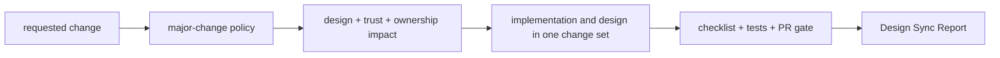

# MalZone Repository Governance Pack

This directory contains the policy and reusable assets that keep implementation, contracts,
security, deployment, operations, and high-level design synchronized.

## Files

1. [Major-change policy](major-change-policy.md) defines classification and required design updates.
2. [Design-sync guardrail](design-sync-guardrail.prompt.md) is the reusable workflow for coding tools.
3. [Design-sync checklist](design-sync-checklist.md) is the reviewer/merge checklist.
4. [Major-change template](major-change-template.md) records architecture and security deltas.

## Usage

1. Read root `CLAUDE.md` and classify every change.
2. Use the guardrail before code, contract, deployment, or policy work.
3. For major changes, complete the template in the PR or review artifact.
4. Update the conformance map and relevant design documents in the same change set.
5. Run `make design-check` and complete the mandatory Design Sync Report.
6. Do not merge if the checklist or report has a failed item.

